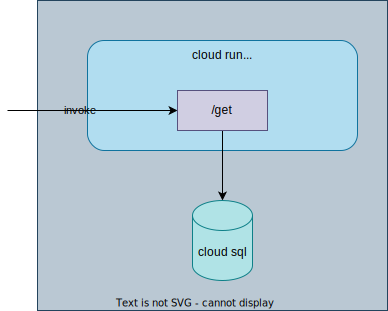

# Cloud Run with Cloud SQL



## Prerequisite

```
gcloud auth login --update-adc
INSTANCE_NAME=naka-test
ZONE=asia-northeast1-b
REGION=asia-northeast1
SA_NAME=helloworld
CLOUDSQLUSER=helloworld
DB_NAME_FOR_IAM_AUTH_USER=helloworld_auth
DB_NAME_FOR_BUILTIN_USER=helloworld
SECRET_NAME=cloudsqluser_pass_helloworld
CLOUDRUN_SERVICE_NAME_FOR_IAM_AUTH_USER=helloworld-auth
CLOUDRUN_SERVICE_NAME_FOR_BUILTIN_USER=helloworld
```

## Local run

Local run with local db:

```
cd helloworld
DB_HOST=localhost DB_USER=postgres DB_NAME=test_db DB_PASS=postgres go run main.go
```

Local run with cloud sql

```
cd helloworld
DB_HOST=localhost DB_USER=your@gmail.com DB_NAME=test_db DB_PASS=$(gcloud sql generate-login-token) go run main.go
```

```
curl localhost:8080
```

## Set Up Cloud SQL

1. Create Cloud SQL instance

    ```
    gcloud sql instances create ${INSTANCE_NAME} \
    --database-version=POSTGRES_15 \
    --cpu=1 \
    --memory=3840MiB \
    --zone=$ZONE \
    --root-password=test \
    --database-flags=cloudsql.iam_authentication=on \
    --project ${PROJECT}
    ```

1. Create database

    ```
    gcloud sql databases create $DB_NAME_FOR_IAM_AUTH_USER --instance=${INSTANCE_NAME} --project ${PROJECT}
    ```

    ```
    gcloud sql databases create $DB_NAME_FOR_BUILTIN_USER --instance=${INSTANCE_NAME} --project ${PROJECT}
    ```

1. Create a Service Account for Cloud Run, which is also used for IAM database authentication for Cloud SQL
    ```
    gcloud iam service-accounts create ${SA_NAME} \
        --description="hello world cloud run service" \
        --display-name="helloworld" \
        --project=${PROJECT}
    ```

1. Create Cloud SQL user for the service account

    ```
    gcloud sql users create ${SA_NAME}@${PROJECT}.iam \
    --instance=${INSTANCE_NAME} \
    --type=cloud_iam_service_account --project ${PROJECT}
    ```
1. Grant roles to the service account

    ```
    gcloud projects add-iam-policy-binding ${PROJECT} \
        --member=serviceAccount:${SA_NAME}@${PROJECT}.iam.gserviceaccount.com \
        --role=roles/cloudsql.instanceUser
    ```
    ```
    gcloud projects add-iam-policy-binding ${PROJECT} \
        --member=serviceAccount:${SA_NAME}@${PROJECT}.iam.gserviceaccount.com \
        --role=roles/cloudsql.client
    ```

    1. [IAM add-iam-policy-binding](https://cloud.google.com/sdk/gcloud/reference/projects/add-iam-policy-binding)
    1. [Cloud SQL IAM Roles](https://cloud.google.com/sql/docs/postgres/iam-roles)

1. Create table `$DB_NAME_FOR_IAM_AUTH_USER.accounts` for `<sa_name>@<project>.iam`

    ```
    cloud-sql-proxy ${PROJECT}:${REGION}:${INSTANCE_NAME}
    ```

    Log in with root (password is set above)

    ```
    psql --host=localhost --username=postgres --dbname=$DB_NAME_FOR_IAM_AUTH_USER
    ```

    ```sql
    CREATE TABLE accounts (
    user_id serial PRIMARY KEY,
    username VARCHAR ( 50 ) UNIQUE NOT NULL,
    password VARCHAR ( 50 ) NOT NULL,
    email VARCHAR ( 255 ) UNIQUE NOT NULL,
    created_on TIMESTAMP NOT NULL,
    last_login TIMESTAMP
    );
    ```

    ```sql
    insert into accounts values (1, 'uid', 'password', 'email@gmail.com', '2023-07-12 00:00:00', '2023-07-12 00:01:00');
    ```

    ```
    psql --host=localhost --username=postgres --dbname=$DB_NAME_FOR_IAM_AUTH_USER -c "alter table accounts owner to \"${SA_NAME}@${PROJECT}.iam\";"
    ```

1. Create Cloud SQL User `helloworld`
    ```
    CLOUDSQLUSER_PASS=$(openssl rand -base64 32)
    ```

    ```
    gcloud sql users create $CLOUDSQLUSER \
        --instance=${INSTANCE_NAME} \
        --password=$CLOUDSQLUSER_PASS \
        --type=cloud_iam_user --project ${PROJECT}
    ```

    ```
    gcloud sql users list --instance ${INSTANCE_NAME} --project ${PROJECT}
    ```
1. Create table `$DB_NAME_FOR_BUILTIN_USER.accounts` for `helloworld`

    ```
    cloud-sql-proxy ${PROJECT}:${REGION}:${INSTANCE_NAME}
    ```

    ```
    PGPASSWORD=$CLOUDSQLUSER_PASS psql --host=localhost --username=$CLOUDSQLUSER --dbname=$DB_NAME_FOR_BUILTIN_USER
    ```

    ```sql
    CREATE TABLE accounts (
    user_id serial PRIMARY KEY,
    username VARCHAR ( 50 ) UNIQUE NOT NULL,
    password VARCHAR ( 50 ) NOT NULL,
    email VARCHAR ( 255 ) UNIQUE NOT NULL,
    created_on TIMESTAMP NOT NULL,
    last_login TIMESTAMP
    );
    ```

    ```sql
    insert into accounts values (1, 'uid', 'password', 'email@gmail.com', '2023-07-12 00:00:00', '2023-07-12 00:01:00');
    ```

1. Grant permission (ToDo)
    ```
    cloud-sql-proxy ${PROJECT}:${REGION}:${INSTANCE_NAME}
    ```

    ```
    psql --host=localhost --username=postgres --dbname=postgres
    ```

    ```
    grant cloudsqlsuperuser to "helloworld@<project_id>.iam";
    ```

## Deploy Cloud Run


### Access with IAM database authentication

```
DB_HOST=$(gcloud sql instances describe ${INSTANCE_NAME} --project ${PROJECT} --format json | jq -r '.ipAddresses[] | select(.type == "PRIMARY").ipAddress')
gcloud run deploy ${CLOUDRUN_SERVICE_NAME_FOR_IAM_AUTH_USER} --service-account ${SA_NAME}@${PROJECT}.iam.gserviceaccount.com \
    --source ./helloworld \
    --set-env-vars CLOUD_SQL_WITH_IAM_AUTH=true \
    --set-env-vars INSTANCE_CONNECTION_NAME=${PROJECT}:${REGION}:${INSTANCE_NAME} \
    --set-env-vars DB_NAME=$DB_NAME_FOR_IAM_AUTH_USER \
    --set-env-vars DB_IAM_USER=${SA_NAME}@${PROJECT}.iam \
    --project ${PROJECT} \
    --region ${REGION} \
    --async
```

```
curl https://helloworld-xxx-an.a.run.app
Hello World!
```

### Access with built-in auth

1. Create secret `$SECRET_NAME`

    ```
    gcloud secrets create $SECRET_NAME \
        --replication-policy="automatic" --project ${PROJECT}
    echo -n "$CLOUDSQLUSER_PASS" | \
        gcloud secrets versions add $SECRET_NAME --data-file=- --project ${PROJECT}
    ```

    - [create secret](https://cloud.google.com/secret-manager/docs/creating-and-accessing-secrets#secretmanager-create-secret-gcloud)
    - [add secret version](https://cloud.google.com/secret-manager/docs/add-secret-version)

1. Grant roles to the service account

    ```
    gcloud secrets add-iam-policy-binding $SECRET_NAME \
        --member="serviceAccount:${SA_NAME}@${PROJECT}.iam.gserviceaccount.com" \
        --role="roles/secretmanager.secretAccessor" --project ${PROJECT}
    ```

1. Deploy
    ```
    gcloud run deploy ${CLOUDRUN_SERVICE_NAME_FOR_BUILTIN_USER} --service-account ${SA_NAME}@${PROJECT}.iam.gserviceaccount.com \
        --source ./helloworld \
        --set-env-vars CLOUD_SQL_WITH_BUILT_IN_USER=true \
        --set-env-vars INSTANCE_CONNECTION_NAME=${PROJECT}:${REGION}:${INSTANCE_NAME} \
        --set-env-vars DB_NAME=$DB_NAME_FOR_BUILTIN_USER \
        --set-env-vars DB_USER=$CLOUDSQLUSER \
        --set-secrets DB_PASS=${SECRET_NAME}:latest \
        --project ${PROJECT} \
        --region ${REGION} \
        --async
    ```

    - [connect from cloud run](https://cloud.google.com/sql/docs/postgres/connect-run)

## Tips

```
gcloud sql users set-password postgres \
    --instance=${INSTANCE_NAME} \
    --project=${PROJECT} \
    --prompt-for-password
```

```
gcloud sql connect ${INSTANCE_NAME} --user=postgres --quiet --project ${PROJECT}
```

## Clean up

```
gcloud run services delete ${CLOUDRUN_SERVICE_NAME_FOR_BUILTIN_USER} --project ${PROJECT} --region ${REGION}
gcloud run services delete ${CLOUDRUN_SERVICE_NAME_FOR_IAM_AUTH_USER} --project ${PROJECT} --region ${REGION}
gcloud sql instances delete ${INSTANCE_NAME} --project ${PROJECT}
gcloud iam service-accounts delete ${SA_NAME}@${PROJECT}.iam.gserviceaccount.com --project ${PROJECT}
gcloud secrets delete $SECRET_NAME --project ${PROJECT}
```

## Ref

1. [connect from cloud run](https://cloud.google.com/sql/docs/postgres/connect-run)
1. [create secret](https://cloud.google.com/secret-manager/docs/creating-and-accessing-secrets#secretmanager-create-secret-gcloud)
1. [add secret version](https://cloud.google.com/secret-manager/docs/add-secret-version)
1. [IAM add-iam-policy-binding](https://cloud.google.com/sdk/gcloud/reference/projects/add-iam-policy-binding)
1. [Cloud SQL IAM Roles](https://cloud.google.com/sql/docs/postgres/iam-roles)
