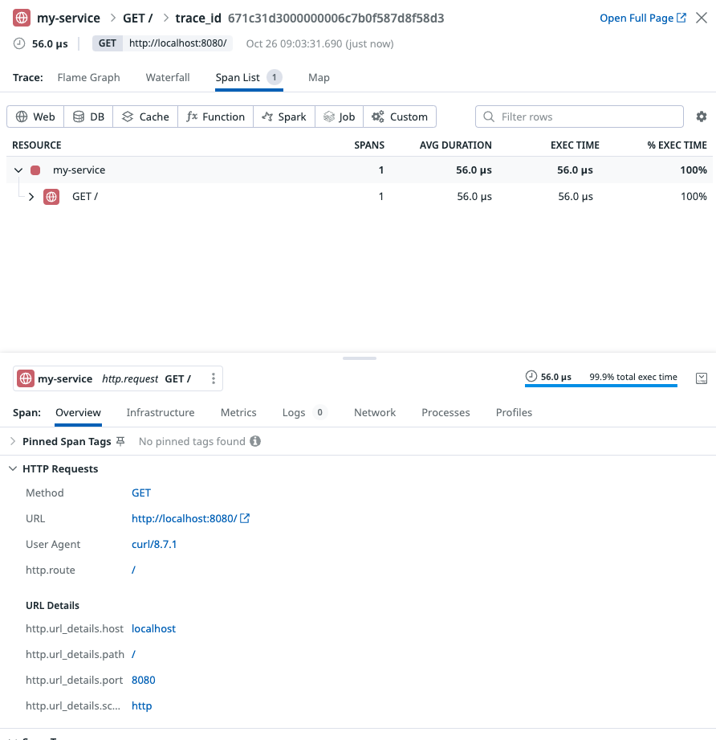

# Datadog HTTP


Package http provides functions to trace the net/http package (https://golang.org/pkg/net/http).

- source code: https://github.com/DataDog/dd-trace-go/blob/v1.69.0/contrib/net/http/http.go#L28
- package: https://pkg.go.dev/gopkg.in/DataDog/dd-trace-go.v1/contrib/net/http#NewServeMux

```go
package main

import (
	"net/http"

	httptrace "gopkg.in/DataDog/dd-trace-go.v1/contrib/net/http"
	"gopkg.in/DataDog/dd-trace-go.v1/ddtrace/tracer"
)

func main() {
	tracer.Start()
	defer tracer.Stop()
	mux := httptrace.NewServeMux(httptrace.WithServiceName("my-service"))
	mux.HandleFunc("/", func(w http.ResponseWriter, r *http.Request) {
		w.Write([]byte("Hello World!\n"))
	})
	http.ListenAndServe(":8080", mux)
}
```

```
go run integrated-examples/datadog/http/main.go
```

```
curl localhost:8080
```



## References

1. [Datadog Agentを使ってローカル環境でDatadog APMにトレースを送信する](https://qiita.com/morieeeenyo/items/b117504115c54eaa6f6b)
1. [MacOSからDatadog APMを送る (with Datadog Agent)](https://qiita.com/nakamasato/items/e51fcc9a98f3279b88d0)
1. [Goのhttp.Requestのキャンセルの仕組みを理解する](https://qiita.com/behiron/items/9b6975de6ff470c71e06)
