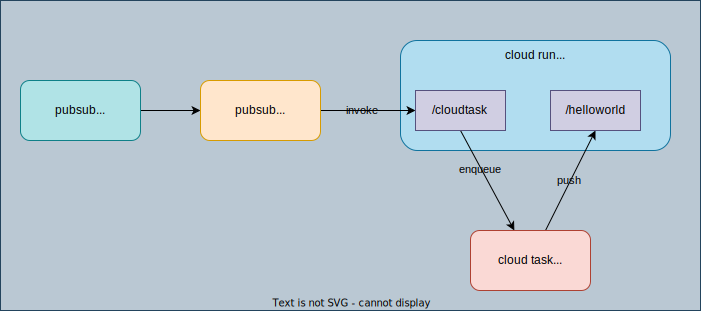
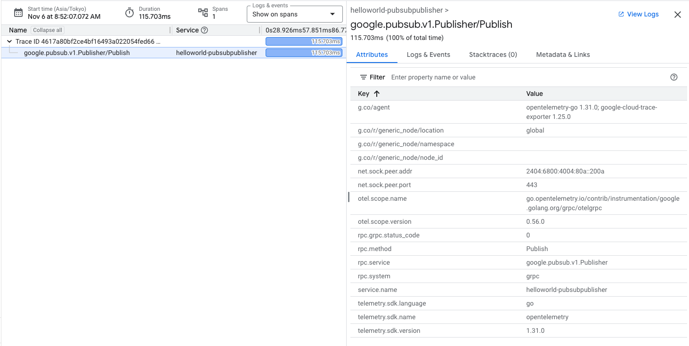

# Tracing with OpenTelemetry on GCP



## Prerequisite

```
export PROJECT=<PROJECT_ID>
export LOCATION_ID=asia-northeast1
export QUEUE_ID=helloworld
```

```
gcloud config set project $PROJECT
gcloud config set compute/region $LOCATION_ID
```

## Components

1. Go app `helloworld` ([ref](https://cloud.google.com/run/docs/quickstarts/build-and-deploy/deploy-go-service))
    1. `/helloworld`: just return `Hello World!`
    2. `/cloudtask`: Create a cloud task
1. PubSub `helloworld`: triggers Cloud Run service `helloworld`
1. Cloud Tasks: Cloud Run service enqueue and invoke `helloworld`

## Deployment

### Cloud Tasks

```
gcloud tasks queues create $QUEUE_ID --location $LOCATION_ID --project $PROJECT
```

### Cloud Run - server (push subscription http endpoint) + pull subscription

build image

```
KO_DOCKER_REPO=$LOCATION_ID-docker.pkg.dev/$PROJECT/cloud-run-source-deploy/helloworld ko build --bare ./helloworld
```

Run the following command in `helloworld` directory:

Set [deterministic URL](https://cloud.google.com/run/docs/triggering/https-request#deterministic) of Cloud Run service:

```
PROJECT_NUMBER=$(gcloud projects describe $PROJECT --format="value(projectNumber)")
CLOUD_RUN_URL=https://helloworld-$PROJECT_NUMBER.$LOCATION_ID.run.app
```

```
gcloud run deploy helloworld --image $LOCATION_ID-docker.pkg.dev/$PROJECT/cloud-run-source-deploy/helloworld:latest --set-env-vars=CLOUD_TASK_TARGET_URL=${CLOUD_RUN_URL}/helloworld,PROJECT_ID=$PROJECT,LOCATION_ID=$LOCATION_ID,QUEUE_ID=$QUEUE_ID,PUBSUB_SUBSCRIPTION_ID=helloworld-pull,OTEL_SERVICE_NAME=helloworld --allow-unauthenticated --region $LOCATION_ID --project $PROJECT
```

Click on the url -> You'll `Hello, World`

```
curl $CLOUD_RUN_URL/helloworld
Hello World!
```

### PubSub

1. Create topic

    ```
    gcloud pubsub topics create helloworld --project $PROJECT
    ```

    ```
    gcloud pubsub topics list --project $PROJECT
    ```

1. Create subscription

    ```
    gcloud pubsub subscriptions create helloworld --push-no-wrapper --push-no-wrapper-write-metadata --topic helloworld --push-endpoint ${CLOUD_RUN_URL}/cloudtask --project $PROJECT
    ```

    `--push-no-wrapper-write-metadata`: <- this is necessary to propagate traceparent via **header** ([ref](https://cloud.google.com/pubsub/docs/payload-unwrapping#unwrapped_message_with_write_metadata_enabled))

    ```
    gcloud pubsub subscriptions list --filter=topic=projects/$PROJECT/topics/helloworld --project $PROJECT
    ```

1. Publish message

    ```
    gcloud pubsub topics publish helloworld --message="helloworld" --project $PROJECT
    ```

    or with go (https://pkg.go.dev/cloud.google.com/go/pubsub)

    ```
    gcloud auth application-default login
    PROJECT_ID=$PROJECT go run pubsubpublisher/main.go
    ```

### Cloud Run Job - pubsubpublisher

```
KO_DOCKER_REPO=$LOCATION_ID-docker.pkg.dev/$PROJECT/cloud-run-source-deploy/helloworld-pubsubpublisher ko build --bare ./pubsubpublisher
```

```
gcloud run jobs deploy helloworld-pubsubpublisher --image $LOCATION_ID-docker.pkg.dev/$PROJECT/cloud-run-source-deploy/helloworld-pubsubpublisher:latest --set-env-vars=PROJECT_ID=$PROJECT,OTEL_SERVICE_NAME=helloworld-pubsubpublisher --region $LOCATION_ID --project $PROJECT
```

> [!NOTE]
> `OTEL_SERVICE_NAME` is used for `service.name` for OpenTelemetry

```
gcloud run jobs execute helloworld-pubsubpublisher --region $LOCATION_ID --project $PROJECT
```




## Code & Trace

### PubSub Publisher

> [!NOTE]
> Subscription must use unwrapped with metadata [ref](https://cloud.google.com/pubsub/docs/payload-unwrapping#unwrapped_message_with_write_metadata_enabled) to send the traceparent via header. The trace context is carried via msg.Attributes and is unwrapped to the header.

```go
attrs := map[string]string{"Content-Type": "application/json"}
msg := &pubsub.Message{Data: []byte("hello world"), Attributes: attrs}
otel.GetTextMapPropagator().Inject(ctx, propagation.MapCarrier(msg.Attributes))
```

Helloworld server: `/createCloudTaskHandler` -> `createCloudTaskHandler` -> Cloud Task -> `/hellworld` -> `hellohandler`


### HTTP Handler

```go
func (s *server) ServeHTTP(w http.ResponseWriter, r *http.Request) {
	router := http.NewServeMux()

	router.Handle("/cloudtask", otelhttp.NewHandler(http.HandlerFunc(s.createCloudTaskHandler), "createCloudTaskHandler"))
	router.Handle("/helloworld", otelhttp.NewHandler(http.HandlerFunc(helloHandler), "helloHandler"))
	router.Handle("/", http.HandlerFunc(helloHandler))
	router.ServeHTTP(w, r)
}
```

### CloudTasks request

(headers & `r.Context()`):

```go
	req := &cloudtaskspb.CreateTaskRequest{
		Parent: s.queue.name,
		Task: &cloudtaskspb.Task{
			MessageType: &cloudtaskspb.Task_HttpRequest{
				HttpRequest: &cloudtaskspb.HttpRequest{
					Url:        s.queue.url,
					HttpMethod: cloudtaskspb.HttpMethod_GET,
					Headers: map[string]string{
						"traceparent": r.Header.Get("traceparent"),
						"tracestate":  r.Header.Get("tracestate"),
					},
					Body:                []byte{},
					AuthorizationHeader: nil,
				},
			},
		},
		ResponseView: 0,
	}
	resp, err := s.cli.CreateTask(r.Context(), req)
```


`publish` (helloworld-publisher)
    -> `helloworld` (subscriber) `pull` (pubsub.Subscription)
    -> cloudtasks create -> `/helloworld`

> [!NOTE]
> - Spans for publish and pull subscription are connected
> - Span for Cloud Run service is not connected!

## Cleanup

1. Cloud Run

    ```
    gcloud run services delete helloworld --region $LOCATION_ID
    ```

1. Cloud Task (cannot be recreated within 7 days)

    ```
    gcloud tasks queues delete $QUEUE_ID --location $LOCATION_ID --project $PROJECT
    ```

1. PubSub

    ```
    gcloud pubsub subscriptions delete helloworld
    gcloud pubsub topics delete helloworld
    ```

## Tips

### Cloud Logging

```
(resource.type="cloud_run_job" AND resource.labels.job_name="helloworld-pubsubpublisher") OR (resource.type = "cloud_run_revision" AND resource.labels.service_name = "helloworld")
```

### PubSub

1. Purge messages
    ```
    gcloud pubsub subscriptions seek helloworld --time=2124-11-08T10:00:00Z --project $PROJECT
    ```
1. `EnableOpenTelemetryTracing` option in client

    This is added in [#10709 feat(pubsub): add opentelemetry tracing support](https://github.com/googleapis/google-cloud-go/pull/10709) and enables `enableTracing` in the client and messageIterator.

    The context propagation mechanism is only enabled when tracing is turned on and is prepended with the `googclient_` prefix. [ref](https://cloud.google.com/pubsub/docs/open-telemetry-tracing)

    **With this `prefix`, you CAN'T connect spans between publish and push subscription http handler.**

1. `WithTelemetryDisabled` option for trace exporter

    ```go
    exporter, err := texporter.New(texporter.WithProjectID(projectID),
            // Disable spans created by the exporter.
            texporter.WithTraceClientOptions(
                []option.ClientOption{option.WithTelemetryDisabled()},
            ),
        )
    ```

1. Connect spans for Publish -> Push subscription -> HTTP Handler -> Cloud Task

    1. Inject in Publish
    1. Extract in HTTP Handler
    1. Trace Context Propagation and `traceparent` header

### Link trace spans with logs and metrics

https://cloud.google.com/trace/docs/setup/go-ot#pass-context


```go
func handleMulti(w http.ResponseWriter, r *http.Request) {
	subRequests := 3 + rand.Intn(4)
	// Write a structured log with the request context, which allows the log to
	// be linked with the trace for this request.
	slog.InfoContext(r.Context(), "handle /multi request", slog.Int("subRequests", subRequests))

	err := computeSubrequests(r, subRequests)
	if err != nil {
		http.Error(w, err.Error(), http.StatusBadGateway)
		return
	}

	fmt.Fprintln(w, "ok")
}
```

```go
// Handle overrides slog.Handler's Handle method. This adds attributes from the
// span context to the slog.Record.
func (t *spanContextLogHandler) Handle(ctx context.Context, record slog.Record) error {
	// Get the SpanContext from the golang Context.
	if s := trace.SpanContextFromContext(ctx); s.IsValid() {
		// Add trace context attributes following Cloud Logging structured log format described
		// in https://cloud.google.com/logging/docs/structured-logging#special-payload-fields
		record.AddAttrs(
			slog.Any("logging.googleapis.com/trace", s.TraceID()),
		)
		record.AddAttrs(
			slog.Any("logging.googleapis.com/spanId", s.SpanID()),
		)
		record.AddAttrs(
			slog.Bool("logging.googleapis.com/trace_sampled", s.TraceFlags().IsSampled()),
		)
	}
	return t.Handler.Handle(ctx, record)
}
```

## References

1. Blog
    1. [Cloud Pub/Sub経由でトレースを取得する](https://zenn.dev/google_cloud_jp/articles/20230626-pubsub-trace): `propagator.Extract` and `propagator.Inject`
    1. [仕様と実装から理解するOpenTelemetryの全体像](https://zenn.dev/ymtdzzz/articles/37c2856f46ea10)
    1. [OpenTelemetry で始める分散トレース](https://qiita.com/atsu_kg/items/c3ee8141e4638957a947)
    1. [OpenTelemetry for Go + Cloud MonitoringでTrace Exemplarを使う](https://zenn.dev/google_cloud_jp/articles/20240305-trace-exemplar)
    1. [dd-trace-goがどのようにcontext propagationを実装しているか](https://medium.com/@eyasy1217/dd-trace-go%E3%81%8C%E5%88%86%E6%95%A3%E3%83%88%E3%83%AC%E3%83%BC%E3%82%B7%E3%83%B3%E3%82%B0%E3%82%92%E3%81%A9%E3%81%AE%E3%82%88%E3%81%86%E3%81%AB%E5%AE%9F%E8%A3%85%E3%81%97%E3%81%A6%E3%81%84%E3%82%8B%E3%81%8B-3410c1dc7030): Easy to understand propagator, span context, carrier
1. GitHub
    1. [#10709 feat(pubsub): add opentelemetry tracing support](https://github.com/googleapis/google-cloud-go/pull/10709)
    1. [pubsub: extract trace information on push subscriptions #10828](https://github.com/googleapis/google-cloud-go/issues/10828) in [v1.42.0](https://github.com/googleapis/google-cloud-go/releases/tag/pubsub%2Fv1.42.0)
        1. [feat(pubsub): allow trace extraction from protobuf message #10827](https://github.com/googleapis/google-cloud-go/pull/10827)
        1. https://github.com/einride/cloudrunner-go/pull/700
    1. [propagation/trace_context.go](https://github.com/open-telemetry/opentelemetry-go/blob/main/propagation/trace_context.go)

1. GCP Cloud Trace with Opentelemetry
    1. OpenTelemetry + Cloud Trace: https://github.com/GoogleCloudPlatform/opentelemetry-operations-go/blob/main/exporter/trace/README.md
    1. [Generate traces and metrics with Go](https://cloud.google.com/trace/docs/setup/go-ot): Link trace spans with logs and metrics
    1. [Pub/Sub OpenTelemetry tracing](https://cloud.google.com/pubsub/docs/open-telemetry-tracing): The context propagation mechanism is only enabled when tracing is turned on and is prepended with the `googclient_` prefix.
    1. [Publish a message with OpenTelemetry tracing enabled](https://cloud.google.com/pubsub/docs/samples/pubsub-publish-otel-tracing)
    1. [opentelemetry-cloud-run](https://github.com/GoogleCloudPlatform/opentelemetry-cloud-run)
1. General
    1. [Trace Context](https://cloud.google.com/trace/docs/trace-context)
    1. https://www.w3.org/TR/trace-context/
