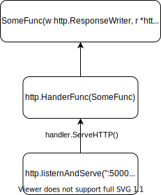
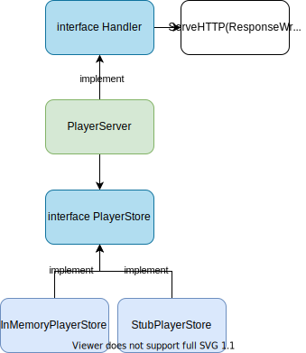
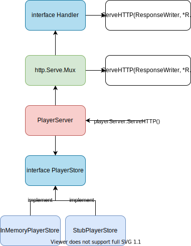
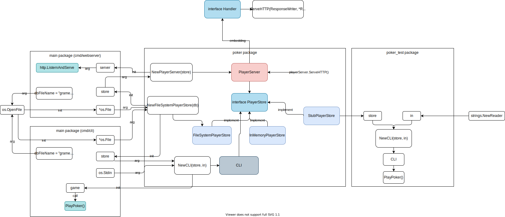
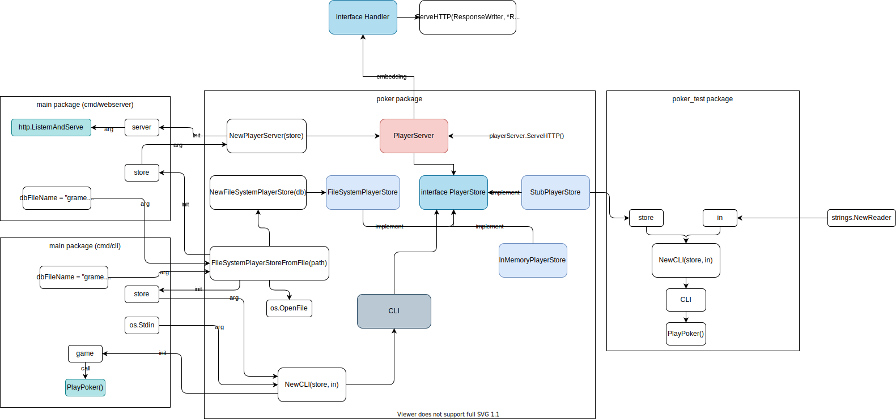
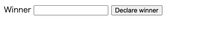

# Build an application

## About the app

1. **Command line app**. Prompts the user to enter the number of players in a game. From then on informs the players of what the "blind bet" value is, which increases over time. At any point a user can enter "{Playername} wins" to finish the game and record the victor in a store.
1. **Web app**. Allows users to record winners of games and displays a league table. Shares the same store as the command line app.
    - GET `/players/<player>`
    - POST `/players/<player>`
## Run the app

1. CLI:

1. Web app:
    ```
    cd cmd/webserver
    go run main.go
    ```

    ```
    curl http://localhost:5000/players/Pepper
    ```

    ```
    curl -X POST http://localhost:5000/players/Pepper
    ```

## [HTTP Server](https://quii.gitbook.io/learn-go-with-tests/build-an-application/http-server)


### Step 1: Implement some function and make handler with HandlerFunc



```go
func ListenAndServe(addr string, handler Handler) error

type Handler interface {
    ServeHTTP(ResponseWriter, *Request)
}
```

[HandlerFunc](https://pkg.go.dev/net/http#HandlerFunc)

The `HandlerFunc` type is an adapter to allow the use of ordinary functions as HTTP handlers.

```go
func PlayerServer(w http.ResponseWriter, r *http.Request) {
    player := strings.TrimPrefix(r.URL.Path, "/players/")
    fmt.Fprint(w, GetPlayerScore(player))
}

func GetPlayerScore(name string) string {
    if name == "Pepper" {
        return "20"
    }
    if name == "Floyd" {
        return "10"
    }
    return ""
}
```

### Step 2: Implement Handler



```go
type PlayerServer struct {
    store PlayerStore
}

func (p *PlayerServer) ServeHTTP(w http.ResponseWriter, r *http.Request) {
    player := strings.TrimPrefix(r.URL.Path, "/players/")
    fmt.Fprint(w, p.store.GetPlayerScore(player))
}
```

## [JSON, routing and embedding](https://quii.gitbook.io/learn-go-with-tests/build-an-application/json)
### Step 3: Routing with [ServeMux](https://golang.org/pkg/net/http/#ServeMux)

```go
router := http.NewServeMux()
router.Handle("/league", http.HandlerFunc(funcA))
router.Handle("/players/", http.HandlerFunc(funcB))

func funcA(w http.ResponseWriter, r *http.Request) {
    // logic for league
}

func funcB(w http.ResponseWriter, r *http.Request) {
    // logic for player
}
```

### Step 4: Set Routing in NewPlayerServer

```go
func NewPlayerServer(store PlayerStore) *PlayerServer {
    p := &PlayerServer{
        store,
        http.NewServeMux(),
    }
    p.router.Handle("/league", http.HandlerFunc(p.leagueHandler))
    p.router.Handle("/players/", http.HandlerFunc(p.playersHandler))
    return p
}
```

### Step 5: Replace `ServeHTTP()` with `http.Handler` in `PlayerServer` by ***embedding***

https://pkg.go.dev/net/http#HandlerFunc.ServeHTTP



```go
type PlayerServer struct {
    store PlayerStore
	http.Handler // embedding: our PlayerServer now has all the methods that http.Handler has, which is just ServeHTTP.
}
```

[***embedding***](https://golang.org/doc/effective_go#embedding): *Go does not provide the typical, type-driven notion of subclassing, but it does have the ability to “borrow” pieces of an implementation by embedding types within a struct or interface.*


```go
func NewPlayerServer(store) *PlayerServer {
    p := new(PlayerServer)
    router := http.NewServerMux()
    ..
    p.Hander = router
    return p
}
```

We can call `ServeHTTP`

```go
store := StubPlayerStore{}
server := NewPlayerServer(&store)
server.ServeHTTP(w, r)
```

**Embedding** is a very interesting language feature. You can use it with interfaces to compose new interfaces. But you need to be careful with misuse (unintended exposion of methods of the embedded class).

```go
type Animal interface {
    Eater
    Sleeper
}
```

**SideNote**: about http.Handler & ServeMux

The process of the following code is nearly the same:
1. set the handler with `Handle` func
    ```go
    http.Handle("/any/", anyHandler)
    http.ListenAndServe(":8080", nil)
    ```
1. set the handler with `ServeMux`
    ```go
    mux := http.NewServeMux()
    mux.Handle("/any/", anyHandler)
    http.ListenAndServe(":8080", mux)
    ```

### Step 6: JSON encode and decode

- Use `encoding/json` package
- Encode `NewEncoder` with `io.Writer` (`http.ResponseWriter` in the example)
    ```go
    json.NewEncoder(w).Encode(leagueTable)
    ```
- Decode `newDecoder` with `io.Reader` (`response.Body` <- `*bytes.Buffer`)
    ```go
    obj := []Object
    json.NewDecoder(r).Decode(&obj)
    ```

## [IO and sorting](https://quii.gitbook.io/learn-go-with-tests/build-an-application/io)
### Step 7: Persist data with JSON file

- `FileSystemPlayerStore` with `database` as `io.Reader`
- Use `strings.NewReader`to create database with JSON string.
    - `newDecoder` to read json as object.

-> this implementation cannot read same thing twice once the Reader reachs the end

### Step 8: ReadSeeker: Seek(offset, whence) enables us to read multiple times

[ReadSeeker](https://golang.org/pkg/io/#ReadSeeker) interface

```go
type ReadSeeker struct {
    Reader
    Seeker
}
```

You can set offset and whence with:

```go
f.database.Seek(0, 0)
```

Luckily, `string.NewReader` also implements `ReadSeeker`.

### Step 9: ReadWriteSeeker

`strings.Reader` does not implement `ReadWriteSeeker`

- Create a temporary file: `*os.File` implements `ReadWriteSeeker`
- Use a [filebuffer](https://github.com/mattetti/filebuffer) library [Mattetti](https://github.com/mattetti): implements the interface

Replace `strings.Reader` with `*os.File` returned by `ioutil.TempFile("", "db")`.

```go
json.NewEncoder(f.database).Encode(league)
```
### [Step 10: More refactoring and performance concerns](https://quii.gitbook.io/learn-go-with-tests/build-an-application/io#more-refactoring-and-performance-concerns)

**Problem**: Every time someone calls `GetLeague()` or `GetPlayerScore()` we are reading the **entire** file and parsing it into JSON. -> Wasteful
**Solution**: Read the whole file only when starting up

1. Add `league` member variable to `FileSystemPlayerStore`.
    ```diff
     type FileSystemPlayerStore struct {
            database io.ReadWriteSeeker
    +       league   League
     }
    ```
1. `GetLeague` just returns from the member variable

    ```go
    func (f *FileSystemPlayerStore) GetLeague() League {
        return f.league
    }
    ```
1. `RecordWins` updates the member variable `league` and write with `f.database` (`io.ReadWriteSeeker`)
    ```diff
    -func (f FileSystemPlayerStore) RecordWin(name string) {
    -       league := f.GetLeague()
    -       player := league.Find(name)
    +func (f *FileSystemPlayerStore) RecordWin(name string) {
    +       player := f.league.Find(name)
    +
            if player != nil {
                    player.Wins++
            } else {
    -               league = append(league, Player{Name: name, Wins: 1})
    +               f.league = append(f.league, Player{Name: name, Wins: 1})
            }
    -       f.database.Seek(0, 0)
    -       json.NewEncoder(f.database).Encode(league)
    +       json.NewEncoder(f.database).Encode(f.league)
     }
    ```
1. Use `NewFileSystemPlayerStore(database)` to initialize.
    ```diff
    +func NewFileSystemPlayerStore(database io.ReadWriteSeeker) *FileSystemPlayerStore {
    +       database.Seek(0, 0)
    +       league, _ := NewLeague(database)
    +       return &FileSystemPlayerStore{
    +               database: database,
    +               league:   league,
    +       }
    +}
    ```

### [Step 11: Separate out the concern of the kind of data we write, from the writing](https://quii.gitbook.io/learn-go-with-tests/build-an-application/io#another-problem)

Problem: If new data is smaller than old data, the old data would remain at the end of the new data. e.g. Write `12345` -> Write `abc` -> Read `abc45` <- Wrong!!) -> Separate out the concern of the kind of **data we write**, from **the writing**

1. Introduce `tape.go`: encapsulate our **"when we write we go from the beginning" functionality**.
    ```go
    package main

    import "io"

    type tape struct {
           file io.ReadWriteSeeker
    }

    func (t *tape) Write(p []byte) (n int, err error) {
           t.file.Seek(0, 0)
           return t.file.Write(p)
    }
    ```
1. Update database of FileSystemPlayerStore from `io.ReadWriteSeeker` to `io.Writer`.
    ```diff
     type FileSystemPlayerStore struct {
    -       database io.ReadWriteSeeker
    +       database io.Writer
            league   League
     }
    ```
1. Update constructor of `FileSystemPlayerStore` to use `type`.
    ```diff
    @@ -14,7 +14,7 @@ func NewFileSystemPlayerStore(database io.ReadWriteSeeker) *FileSystemPlayerStor
            database.Seek(0, 0)
            league, _ := NewLeague(database)
            return &FileSystemPlayerStore{
    -               database: database,
    +               database: &tape{database},
                    league:   league,
            }
     }
    ```

Separation of concern completed!

### [Step 12 Enable to truncate the old data](https://quii.gitbook.io/learn-go-with-tests/build-an-application/io#write-the-test-first-4)

1. Add test case: Write `12345` -> Write `abc` -> Read `abc` (`file` -> `&tape{file}` -> `tape.Write([]byte("abc"))`) `tape_test.go`
    ```go
    package main

    import (
           "io/ioutil"
           "testing"
    )

    func TestTape_Write(t *testing.T) {
           file, clean := createTempFile(t, "12345")
           defer clean()

           tape := &tape{file}

           tape.Write([]byte("abc"))

           file.Seek(0, 0)
           newFileContents, _ := ioutil.ReadAll(file)

           got := string(newFileContents)
           want := "abc"

           if got != want {
                   t.Errorf("got %q want %q", got, want)
           }
    }
    ```
1. `os.File` has a truncate function. Use the type instead of `io.ReadWriteSeeker`
    ```diff
     package main

    -import "io"
    +import (
    +       "os"
    +)

     type tape struct {
    -       file io.ReadWriteSeeker
    +       file *os.File
     }

     func (t *tape) Write(p []byte) (n int, err error) {
    +       t.file.Truncate(0)
            t.file.Seek(0, 0)
            return t.file.Write(p)
     }
    ```

    For more details about `io.Reader`, `io.Writer`, and `*os.File`, check [Appendix](##Appendix)

1. Fix the compile errors (Change **data's type** from `io.ReadWriteSeeker` to `*os.File`).

    `file_system_store_test.go`:

    ```diff
    +++ b/learn-go-with-tests/02-build-an-application/file_system_store_test.go
    @@ -1,13 +1,12 @@
     package main

     import (
    -       "io"
            "io/ioutil"
            "os"
            "testing"
     )

    -func createTempFile(t testing.TB, initialData string) (io.ReadWriteSeeker, func()) {
    +func createTempFile(t testing.TB, initialData string) (*os.File, func()) {
            t.Helper()
            tmpfile, err := ioutil.TempFile("", "db")
            if err != nil {
    ```

    `file_system_store.go`:

    ```diff
    +++ b/learn-go-with-tests/02-build-an-application/file_system_store.go
    @@ -3,6 +3,7 @@ package main
     import (
            "encoding/json"
            "io"
    +       "os"
     )

     type FileSystemPlayerStore struct {
    @@ -10,7 +11,7 @@ type FileSystemPlayerStore struct {
            league   League
     }

    -func NewFileSystemPlayerStore(database io.ReadWriteSeeker) *FileSystemPlayerStore {
    +func NewFileSystemPlayerStore(database *os.File) *FileSystemPlayerStore {
            database.Seek(0, 0)
            league, _ := NewLeague(database)
            return &FileSystemPlayerStore{
    ```

### [Step 13 Small refactor](https://quii.gitbook.io/learn-go-with-tests/build-an-application/io#one-other-small-refactor)

Move `json.NewEncoder(f.database)` from `WriteWin` to `NewFileSystemPlayerStore`. No need to encode every time we write.

`file_system_store.go`:

```diff
 import (
        "encoding/json"
-       "io"
        "os"
 )

 type FileSystemPlayerStore struct {
-       database io.Writer
+       database *json.Encoder
        league   League
 }
@@ -15,7 +14,7 @@ func NewFileSystemPlayerStore(database *os.File) *FileSystemPlayerStore {
        database.Seek(0, 0)
        league, _ := NewLeague(database)
        return &FileSystemPlayerStore{
-               database: &tape{database},
+               database: json.NewEncoder(&tape{database}),
                league:   league,
        }
 }
@@ -40,5 +39,5 @@ func (f *FileSystemPlayerStore) RecordWin(name string) {
        } else {
                f.league = append(f.league, Player{Name: name, Wins: 1})
        }
-       json.NewEncoder(f.database).Encode(f.league)
+       f.database.Encode(f.league)
 }
```

`main.go`:

```diff
 package main

 import (
+       "encoding/json"
        "log"
        "net/http"
        "os"
@@ -14,7 +15,7 @@ func main() {
                log.Fatalf("problem opening %s %v", dbFileName, err)
        }

-       store := &FileSystemPlayerStore{db, League{}}
+       store := &FileSystemPlayerStore{json.NewEncoder(db), League{}}
        server := NewPlayerServer(store)
        // server := NewPlayerServer(NewInMemoryPlayerStore())
```

### [Step 14: Error handling](https://quii.gitbook.io/learn-go-with-tests/build-an-application/io#error-handling)

`league, _ := NewLeague(f.database)` -> `league, err := NewLeague(f.database)`


`file_system_store.go`:

```diff
+++ b/learn-go-with-tests/02-build-an-application/file_system_store.go
@@ -2,6 +2,7 @@ package main

 import (
        "encoding/json"
+       "fmt"
        "os"
 )

@@ -10,13 +11,16 @@ type FileSystemPlayerStore struct {
        league   League
 }

-func NewFileSystemPlayerStore(database *os.File) *FileSystemPlayerStore {
-       database.Seek(0, 0)
-       league, _ := NewLeague(database)
+func NewFileSystemPlayerStore(file *os.File) (*FileSystemPlayerStore, error) {
+       file.Seek(0, 0)
+       league, err := NewLeague(file)
+       if err != nil {
+               return nil, fmt.Errorf("problem loading player store from file %s, %v", file.Name(), err)
+       }
        return &FileSystemPlayerStore{
-               database: json.NewEncoder(&tape{database}),
+               database: json.NewEncoder(&tape{file}),
                league:   league,
-       }
+       }, nil
 }
```

`file_system_store_test.go`:

```diff
--- a/learn-go-with-tests/02-build-an-application/file_system_store_test.go
+++ b/learn-go-with-tests/02-build-an-application/file_system_store_test.go
@@ -28,7 +28,8 @@ func TestFileSystemStore(t *testing.T) {
             {"Name": "Cleo", "Wins": 10},
             {"Name": "Chris", "Wins": 33}]`)
                defer cleanDatabase()
-               store := NewFileSystemPlayerStore(database)
+               store, err := NewFileSystemPlayerStore(database)
+               assertNoError(t, err)
                got := store.GetLeague()
                want := []Player{
                        {"Cleo", 10},
@@ -45,7 +46,7 @@ func TestFileSystemStore(t *testing.T) {
                        {"Name": "Cleo", "Wins": 10},
                        {"Name": "Chris", "Wins": 33}]`)
                defer cleanDatabase()
-               store := NewFileSystemPlayerStore(database)
+               store, _ := NewFileSystemPlayerStore(database)
                got := store.GetPlayerScore("Chris")
                want := 33
                assertScoreEquals(t, got, want)
@@ -56,7 +57,7 @@ func TestFileSystemStore(t *testing.T) {
                        {"Name": "Cleo", "Wins": 10},
                        {"Name": "Chris", "Wins": 33}]`)
                defer cleanDatabase()
-               store := NewFileSystemPlayerStore(database)
+               store, _ := NewFileSystemPlayerStore(database)
                store.RecordWin("Chris")
                got := store.GetPlayerScore("Chris")
                want := 34
@@ -68,7 +69,7 @@ func TestFileSystemStore(t *testing.T) {
                        {"Name": "Cleo", "Wins": 10},
                        {"Name": "Chris", "Wins": 33}]`)
                defer cleanDatabase()
-               store := NewFileSystemPlayerStore(database)
+               store, _ := NewFileSystemPlayerStore(database)
                store.RecordWin("Pepper")
                got := store.GetPlayerScore("Pepper")
                want := 1
@@ -81,3 +82,10 @@ func assertScoreEquals(t *testing.T, got, want int) {
                t.Errorf("got %d want %d", got, want)
        }
 }
+
+func assertNoError(t testing.TB, err error) {
+       t.Helper()
+       if err != nil {
+               t.Fatalf("didn't expect an error but got one, %v", err)
+       }
+}
```

`main.go`:

```diff
@@ -1,7 +1,6 @@
 package main

 import (
-       "encoding/json"
        "log"
        "net/http"
        "os"
@@ -15,7 +14,10 @@ func main() {
                log.Fatalf("problem opening %s %v", dbFileName, err)
        }

-       store := &FileSystemPlayerStore{json.NewEncoder(db), League{}}
+       store, err := NewFileSystemPlayerStore(db)
+       if err != nil {
+               log.Fatalf("problem creating file system player store, %v ", err)
+       }
        server := NewPlayerServer(store)
        // server := NewPlayerServer(NewInMemoryPlayerStore())
        log.Fatal(http.ListenAndServe(":5000", server))
```

`server_integration_test.go`:

```diff
--- a/learn-go-with-tests/02-build-an-application/server_intergration_test.go
+++ b/learn-go-with-tests/02-build-an-application/server_intergration_test.go
@@ -37,9 +37,10 @@ func TestRecordingWinsAndRetrievingThemWithInMemoryStore(t *testing.T) {
 }

 func TestRecordingWinsAndRetrievingThemWithFileSystemStore(t *testing.T) {
-       database, cleanDatabase := createTempFile(t, "")
+       database, cleanDatabase := createTempFile(t, `[]`)
        defer cleanDatabase()
-       store := NewFileSystemPlayerStore(database)
+       store, err := NewFileSystemPlayerStore(database)
+       assertNoError(t, err)
        server := NewPlayerServer(store)
        player := "Pepper"
```

All tests passed! Do not forget `file.Seek(0, 0)` in `NewFileSystemPlayerStore`! You can also check the simplified version in [string to object](../pragmatic-cases/string-to-object).

### [Step 15: Enable to initialize NewFileSystemPlayerStore with empty file](https://quii.gitbook.io/learn-go-with-tests/build-an-application/io#write-the-test-first-5)

Add test first:

```go
	t.Run("works with an empty file", func(t *testing.T) {
		database, cleanDatabase := createTempFile(t, "")
		defer cleanDatabase()

		_, err := NewFileSystemPlayerStore(database)

		assertNoError(t, err)
	})
```

Add logic to set `[]` for an empty file. To gudge if the target file is empty, we can use `file.Stat()`.

```go
	info, err := file.Stat()

	if err != nil {
		return nil, fmt.Errorf("problem getting file info from file %s, %v", file.Name(), err)
	}

	if info.Size() == 0 {
		file.Write([]byte("[]"))
		file.Seek(0, 0)
	}
```

For refactoring, we move the logic to a separate function `initialisePlayerDBFile`.

### [Step 16: Sorting](https://quii.gitbook.io/learn-go-with-tests/build-an-application/io#sorting)

Add test:
```go
	t.Run("league sorted", func(t *testing.T) {
		database, cleanDatabase := createTempFile(t, `[
        {"Name": "Cleo", "Wins": 10},
        {"Name": "Chris", "Wins": 33}]`)
		defer cleanDatabase()

		store, err := NewFileSystemPlayerStore(database)

		assertNoError(t, err)

		got := store.GetLeague()

		want := []Player{
			{"Chris", 33},
			{"Cleo", 10},
		}

		assertLeague(t, got, want)

		// read again
		got = store.GetLeague()
		assertLeague(t, got, want)
	})
```

Sort by `sort.Slice` in `GetLeague`:

```diff
+++ b/learn-go-with-tests/02-build-an-application/file_system_store.go
@@ -4,6 +4,7 @@ import (
        "encoding/json"
        "fmt"
        "os"
+       "sort"
 )

 type FileSystemPlayerStore struct {
@@ -54,7 +55,10 @@ func initialisePlayerDBFile(file *os.File) error {
 }

 func (f *FileSystemPlayerStore) GetLeague() League {
-       return f.league
+    sort.Slice(f.league, func(i, j int) bool {
+        return f.league[i].Wins > f.league[j].Wins
+    })
+    return f.league
 }
```

## [Command line & package structure](https://quii.gitbook.io/learn-go-with-tests/build-an-application/command-line)

**command line application** -> share the database with two applications

### [Step 17: Separate poker package from main](https://quii.gitbook.io/learn-go-with-tests/build-an-application/command-line#some-project-refactoring-first)

1. Move `main.go` to `cmd/webserver/main.go`
1. Change the package of all remaining files under the root directory from `main` to `poker`.
1. Import `tmp/learn-go-with-tests/02-build-an-application` in `cmd/webserver/main.go` and use`poker` before the imported function and class.

Check:
- [x] `go test` pass
- [x] `go run main.go` in `cmd/webserver` dir and `curl http://localhost:5000/league`

### [Step 18: Create new cli application](https://quii.gitbook.io/learn-go-with-tests/build-an-application/command-line#walking-skeleton)


1. `cmd/cli/main.go`:

    ```go
    package main

    import "fmt"

    func main() {
        fmt.Println("Let's play poker")
    }
    ```

1. Add a failing test: *Playing a poker with CLI would increment **winCalls** in the playstore configured for the CLI.*

    ```go
    package poker

    import "testing"

    func TestCLI(t *testing.T)  {
        playerStore := &StubPlayerStore{}
        cli:= &CLI{playerStore}
        cli.PlayPoker()

        if len(playerStore.winCalls) != 1 {
            t.Fatal("expected a win call but didn't get any")
        }
    }
    ```

1. Add the minimum code `CLI.go`: *PlayPoker function calls **RecordWin** once with random random person, which increments **winCalls**.*

    ```go
    package poker

    type CLI struct {
        playerStore PlayerStore
    }

    func (cli *CLI) PlayPoker() {
        cli.playerStore.RecordWin("Cleo")
    }
    ```

    The test passes!

1. Add another test: *Initialize CLI with `PlayStore` and `io.Reader` which has "Chris wins\n" as an input, and play once, then first **winCalls** in the `playStore` is expected to be "Chris"*

```go
func TestCLI(t *testing.T) {
    in := strings.NewReader("Chris wins\n")
    playerStore := &StubPlayerStore{}

    cli := &CLI{playerStore, in}
    cli.PlayPoker()

    if len(playerStore.winCalls) != 1 {
        t.Fatal("expected a win call but didn't get any")
    }

    got := playerStore.winCalls[0]
    want := "Chris"

    if got != want {
        t.Errorf("didn't record correct winner, got %q, want %q", got, want)
    }
}
```

1. Update `CLI.go`:

    - Add `in io.Reader` to `CLI` struct.
    - Call `RecordWin` with `"Chris"`.

    Then the test passed.

1. Refactoring

At this point, `cli` app cannot call `RecordWin` with the given player.
### [Step 19: Call RecordWin with the given player from CLI](https://quii.gitbook.io/learn-go-with-tests/build-an-application/command-line#write-the-test-first-2)

1. Test: *Call with "Chris wins" -> winner should be "Chris". Call with "Cleo wins" -> winner should be "Cleo"*

    ```go
    func TestCLI(t *testing.T) {

        t.Run("record chris win from user input", func(t *testing.T) {
            in := strings.NewReader("Chris wins\n")
            playerStore := &StubPlayerStore{}

            cli := &CLI{playerStore, in}
            cli.PlayPoker()

            assertPlayerWin(t, playerStore, "Chris")
        })

        t.Run("record cleo win from user input", func(t *testing.T) {
            in := strings.NewReader("Cleo wins\n")
            playerStore := &StubPlayerStore{}

            cli := &CLI{playerStore, in}
            cli.PlayPoker()

            assertPlayerWin(t, playerStore, "Cleo")
        })

    }
    ```
1. Enable to read the winner from `in` in `PlayPoker` function.

    Use [bufio.Scanner](https://golang.org/pkg/bufio/)

    ```diff
    -import "io"
    +import (
    +       "bufio"
    +       "io"
    +       "strings"
    +)

     type CLI struct {
            playerStore PlayerStore
    @@ -8,5 +12,11 @@ type CLI struct {
     }

     func (cli *CLI) PlayPoker() {
    -       cli.playerStore.RecordWin("Chris")
    +       reader := bufio.NewScanner(cli.in)
    +       reader.Scan()
    +       cli.playerStore.RecordWin(extractWinner(reader.Text()))
    +}
    +
    +func extractWinner(userInput string) string {
    +       return strings.Replace(userInput, " wins", "", 1)
     }
    ```

1. Wire up into `cmd/cli/main.go`.

    ```go
    package main

    import (
        "fmt"
        "log"
        "os"
        "tmp/learn-go-with-tests/02-build-an-application"
    )

    const dbFileName = "game.db.json"

    func main() {
        fmt.Println("Let's play poker")
        fmt.Println("Type {Name} wins to record a win")

        db, err := os.OpenFile(dbFileName, os.O_RDWR|os.O_CREATE, 0666)

        if err != nil {
            log.Fatalf("problem opening %s %v", dbFileName, err)
        }

        store, err := poker.NewFileSystemPlayerStore(db)

        if err != nil {
            log.Fatalf("problem creating file system player store, %v ", err)
        }
        game := poker.CLI{store, os.Stdin}
        game.PlayPoker()
    }
    ```

    `go run main.go` because `playerStore` and `in` are not exposed ouside the package `poker`. we're calling from `main` package.
    ```
    ./main.go:27:20: implicit assignment of unexported field 'playerStore' in poker.CLI literal
    ./main.go:27:29: implicit assignment of unexported field 'in' in poker.CLI literal
    ```

    1. Separate a package for testing (`_test` package) to just use **exposed** types. -> `package poker_test`
    1. Test public API.
    1. Put stubs and test helpers in `testing.go` as it's very convenient for users of the package.
    1. Update `CLI.go`
        1. Change the type of `in` from `io.Reader` to `*bufio.Scanner`.
        1. Create `NewCLI()`, in which we convert `in io.Reader` to `in: bufio.NewScanner(in)`
        1. Create `readLind()` to read by `cli.in.Scan()` and return `cli.in.Text()`
    1. Use `NewCLI` in `cmd/cli/main.go` instead of initializing a raw `CLI`.

    [Advanced Testing with Go](https://speakerdeck.com/mitchellh/advanced-testing-with-go)



### [Step 20: [Refactor] Commonize openfile logic](https://quii.gitbook.io/learn-go-with-tests/build-an-application/command-line#refactor-1)

1. Refactor duplicated `Openfile` and initialization of `FileSystemPlayerStore` -> `FileSystemPlayerStoreFromFile` in `file_system_store.go`, which calls `os.Openfile` with the given `path`.

    ```go
    func FileSystemPlayerStoreFromFile(path string) (*FileSystemPlayerStore, func(), error) {
        db, err := os.OpenFile(path, os.O_RDWR|os.O_CREATE, 0666)

        if err != nil {
            return nil, nil, fmt.Errorf("problem opening %s %v", path, err)
        }

        closeFunc := func() {
            db.Close()
        }

        store, err := NewFileSystemPlayerStore(db)

        if err != nil {
            return nil, nil, fmt.Errorf("problem creating file system player store, %v ", err)
        }

        return store, closeFunc, nil
    }
    ```

1. Update `cmd/cli/main.go`

    ```diff
    +++ b/learn-go-with-tests/02-build-an-application/cmd/cli/main.go
    @@ -13,13 +13,11 @@ func main() {
            fmt.Println("Let's play poker")
            fmt.Println("Type {Name} wins to record a win")

    -       db, err := os.OpenFile(dbFileName, os.O_RDWR|os.O_CREATE, 0666)
    -
    +       store, close, err := poker.FileSystemPlayerStoreFromFile(dbFileName)
            if err != nil {
    -               log.Fatalf("problem opening %s %v", dbFileName, err)
    +               log.Fatal(err)
            }
    -
    -       store, err := poker.NewFileSystemPlayerStore(db)
    +       defer close()

    ```

1. Update `cmd/webserver/main.go`

    ```diff
    +++ b/learn-go-with-tests/02-build-an-application/cmd/webserver/main.go
    @@ -10,15 +10,13 @@ import (
     const dbFileName = "game.db.json"

     func main() {
    -       db, err := os.OpenFile(dbFileName, os.O_RDWR|os.O_CREATE, 0666)
    -       if err != nil {
    -               log.Fatalf("problem opening %s %v", dbFileName, err)
    -       }
    +       store, close, err := poker.FileSystemPlayerStoreFromFile(dbFileName)

    -       store, err := poker.NewFileSystemPlayerStore(db)
            if err != nil {
    -               log.Fatalf("problem creating file system player store, %v ", err)
    +               log.Fatal(err)
            }
    +       defer close()
    +
    ```



### Wrap up

1. Separate folders for `main` for different applications
1. Unaccessible to unexported types from other packages
1. `_text` package for testing in the same way as other packages use your code.
1. `os.Stdin` implements `io.Reader`.
1. `bufio.Scanner` to read line by line.
## [Time](https://quii.gitbook.io/learn-go-with-tests/build-an-application/time)

a group of people play Texas-Holdem Poker.
### [Step 21: Periodic operation with time.AfterFunc](https://quii.gitbook.io/learn-go-with-tests/build-an-application/time)

1. Create new test in `CLI_test.go`.

    ```go
	t.Run("it schedules printing of blind values", func(t *testing.T) {
		in := strings.NewReader("Chris wins\n")
		playerStore := &poker.StubPlayerStore{}
		blindAlerter := &SpyBlindAlerter{}

		cli := poker.NewCLI(playerStore, in, blindAlerter)
		cli.PlayPoker()

		if len(blindAlerter.alerts) != 1 {
			t.Fatal("expected a blind alert to be scheduled")
		}
	})
    ```
1. Add `SpyBlindAlerter` in `CLI_test.go`

    You can set an alert with `scheduledAt` adn `amount`.
    ```go
    type SpyBlindAlerter struct {
        alerts []struct{
            scheduledAt time.Duration
            amount int
        }
    }

    func (s *SpyBlindAlerter) ScheduleAlertAt(duration time.Duration, amount int) {
        s.alerts = append(s.alerts, struct {
            scheduledAt time.Duration
            amount int
        }{duration,  amount})
    }
    ```

1. Create interface `BlindAlerter` and add new argument `alert BlindAlerter` to `NewCLI`.

    ```go
    type BlindAlerter interface {
        ScheduleAlertAt(duration time.Duration, amount int)
    }
    ```
1. Create an interface `BlindAlerterFunc`
    ```go
    type BlindAlerterFunc func(duration time.Duration, amount int)

    func (a BlindAlerterFunc) ScheduleAlertAt(duration time.Duration, amount int) {
        a(duration, amount)
    }

    func StdOutAlerter(duration time.Duration, amount int) {
        time.AfterFunc(duration, func(){
            fmt.Fprintf(os.Stdout, "Blind is now %d\n", amount)
        })
    }
    ```

1. Update `cmd/cli/main.go`
    ```go
    poker.NewCLI(store, os.Stdin, poker.BlindAlerterFunc(poker.StdOutAlerter)).PlayPoker()
    ```

1. Run the app. (better to change `blindTime = blindTime + 10*time.Minute` from `Minute` to `Second`)
    ```
    go run main.go
    ```

    ```
    Let's play poker
    Type {Name} wins to record a win
    Blind is now 100
    Blind is now 200
    Blind is now 300
    Blind is now 400
    Blind is now 500
    Blind is now 600
    Blind is now 800
    Blind is now 1000
    Blind is now 2000
    ```

### [Step 22: Add Stdout to CLI](https://quii.gitbook.io/learn-go-with-tests/build-an-application/time#write-the-test-first-2)

1. Add test with dummies.

    ```go
    var dummyBlindAlerter = &SpyBlindAlerter{}
    var dummyPlayerStore = &poker.StubPlayerStore{}
    var dummyStdIn = &bytes.Buffer{}
    var dummyStdOut = &bytes.Buffer{}
    ```

    ```go
	t.Run("it prompts the user to enter the number of players", func(t *testing.T) {
		stdout := &bytes.Buffer{}
		cli := poker.NewCLI(dummyPlayerStore, dummyStdIn, stdout, dummyBlindAlerter)
		cli.PlayPoker()

		got := stdout.String()
		want := "Please enter the number of players: "

		if got != want {
			t.Errorf("got %q, want %q", got, want)
		}
	})
    ```

    For existing tests, use `dummyStdOut`
1. Add `io.Writer` to `NewCLI`.
    ```diff
    -func NewCLI(store PlayerStore, in io.Reader, alerter BlindAlerter) *CLI {
    +func NewCLI(store PlayerStore, in io.Reader, out io.Writer, alerter BlindAlerter) *CLI {
    ```
1. Add `out` to `CLI`.
    ```diff
    type CLI struct {

    }
    ```
1. Add a line to `PlayPoker()`.
    ```go
    const PlayerPrompt = "..."
    ...
    fmt.Fprint(cli.out, PlayerPrompt)
    ```

### [Step 23: Receive the number of players from stdin](https://quii.gitbook.io/learn-go-with-tests/build-an-application/time#write-the-test-first-3)
1. Add test
    ```go
	t.Run("it prompts the user to enter the number of players", func(t *testing.T) {
		stdout := &bytes.Buffer{}
		in := strings.NewReader("7\n")
		blindAlerter := &SpyBlindAlerter{}

		cli := poker.NewCLI(dummyPlayerStore, in, stdout, blindAlerter)
		cli.PlayPoker()

		got := stdout.String()
		want := poker.PlayerPrompt

		if got != want {
			t.Errorf("got %q, want %q", got, want)
		}

		cases := []scheduledAlert{
			{0 * time.Second, 100},
			{12 * time.Minute, 200},
			{24 * time.Minute, 300},
			{36 * time.Minute, 400},
		}

		for i, want := range cases {
			t.Run(fmt.Sprint(want), func(t *testing.T) {

				if len(blindAlerter.alerts) <= i {
					t.Fatalf("alert %d was not scheduled %v", i, blindAlerter.alerts)
				}

				got := blindAlerter.alerts[i]
				assertScheduledAlert(t, got, want)
			})
		}
	})
    ```
1. Read and convert it to `int`.
    ```go
    numberOfPlayers, err := strconv.Atoi(cli.readLine())
    ```
1. Fix other tests.
    ```diff
            t.Run("record chris win from user input", func(t *testing.T) {
    -               in := strings.NewReader("Chris wins\n")
    +               in := strings.NewReader("5\nChris wins\n")
                    playerStore := &poker.StubPlayerStore{}

                    cli := poker.NewCLI(playerStore, in, dummyStdOut, dummySpyAlerter)
    @@ -29,7 +29,7 @@ func TestCLI(t *testing.T) {
            })

            t.Run("record cleo win from user input", func(t *testing.T) {
    -               in := strings.NewReader("Cleo wins\n")
    +               in := strings.NewReader("5\nCleo wins\n")
                    playerStore := &poker.StubPlayerStore{}

                    cli := poker.NewCLI(playerStore, in, dummyStdOut, dummySpyAlerter)
    @@ -39,7 +39,7 @@ func TestCLI(t *testing.T) {
            })

            t.Run("it schedules printing of blind values", func(t *testing.T) {
    -               in := strings.NewReader("Chris wins\n")
    +               in := strings.NewReader("5\nChris wins\n")
                    playerStore := &poker.StubPlayerStore{}
                    blindAlerter := &SpyBlindAlerter{}
    ```

### [Step 24: Separate game from CLI](https://quii.gitbook.io/learn-go-with-tests/build-an-application/time#refactor-2)

4 dependencies to setup CLI -> introduce `Game` for better test:
- `Start`: need to know how many people are playing
- `Finish`: need to declare the winner

Changes:
1. Create new type `Game` with `BlindAlerter` and `PlayerStore`.
    ```go
    type Game struct {
        alerter BlindAlerter
        store PlayerStore
    }
    ```
1. Moved `CLI.scheduleBlindAlerts` to `Game.Start`.
    ```go
    func (p *Game) Start(numberOfPlayers int) {
        blindIncrement := time.Duration(5+numberOfPlayers) * time.Minute

        blinds := []int{100, 200, 300, 400, 500, 600, 800, 1000, 2000, 4000, 8000}
        blindTime := 0 * time.Second
        for _, blind := range blinds {
            p.alerter.ScheduleAlertAt(blindTime, blind)
            blindTime = blindTime + blindIncrement
        }
    }
    ```
1. Moved `store.RecordWin` to `Game.Finish()`.
    ```go
    func (p *TexasHoldem) Finish(winner string) {
        p.store.RecordWin(winner)
    }
    ```
1. Use `Game` in `CLI`.
    ```diff
     type CLI struct {
    -       playerStore PlayerStore
    -       in          *bufio.Scanner
    -       out         io.Writer
    -       alerter     BlindAlerter
    +       in   *bufio.Scanner
    +       out  io.Writer
    +       game Game
     }
    ```
1. Move Game-specific tests from `CLI_test` to `game_test`.

1. CLI no longer relies on a concrete Game! -> Make an interface for it.
    ```go
    type Game interface {
    	Start(numberOfPlayers int)
    	Finish(winner string)
    }
    ```
1. Rename `Game` to `TexasHoldem` with `Game` interface. (`*Game` -> `Game` in CLI.)
1. Create `GameSpy` in `CLI_test`
    ```go
    type GameSpy struct {
        StartedWith  int
        FinishedWith string
    }

    func (g *GameSpy) Start(numberOfPlayers int) {
        g.StartedWith = numberOfPlayers
    }

    func (g *GameSpy) Finish(winner string) {
        g.FinishedWith = winner
    }
    ```


### [Step 25: Error handling for wrong input](https://quii.gitbook.io/learn-go-with-tests/build-an-application/time#write-the-test-first-4)

1. Return when failing to convert the given string into an integer in `CLI.go`.
    ```go
    const BadPlayerInputErrMsg = "Bad value received for number of players, please try again with a number"

	if err != nil {
		fmt.Fprint(cli.out, BadPlayerInputErrMsg)
		return
	}
    ```
1. Refactor CLI_test.
    1. `userSends` for common function to generate `io.Reader` for `in`.
    1. `assertFinishCalledWith` to check the winner.
    1. `assertGameStartedWith` to check if the given number of players is set.
    1. `assertGameNotStarted` to check if `Start` is called.
    1. `assertMessagesSentToUser` to check if expected string is sent as stdout.

## [Websockets](https://quii.gitbook.io/learn-go-with-tests/build-an-application/websockets)

### [Step 26: Serve up an HTML to users when they hit /game](https://quii.gitbook.io/learn-go-with-tests/build-an-application/websockets#write-the-test-first)

1. Write test to GET /game successfully in `server_test.go`.

    ```go
    func TestGame(t *testing.T) {
        t.Run("GET /game returns 200", func(t *testing.T) {
            server := NewPlayerServer(&StubPlayerStore{})

            request, _ := http.NewRequest(http.MethodGet, "/game", nil)
            response := httptest.NewRecorder()

            server.ServeHTTP(response, request)

            assertStatus(t, response.Code, http.StatusOK)
        })
    }
    ```
1. Add handler to the router in `server.go`.
    ```go
    func NewPlayerServer() {
        ...
        router.Handle("/game", http.HandlerFunc(p.game))
        ...
    }
    ...
    func (p *PlayerServer) game(w http.ResponseWriter, r *http.Request) {
	    w.WriteHeader(http.StatusOK)
    }
    ```

1. Prepare `game.html`

    ```html
    <!DOCTYPE html>
    <html lang="en">
    <head>
        <meta charset="UTF-8">
        <title>Let's play poker</title>
    </head>
    <body>
    <section id="game">
        <div id="declare-winner">
            <label for="winner">Winner</label>
            <input type="text" id="winner"/>
            <button id="winner-button">Declare winner</button>
        </div>
    </section>
    </body>
    <script type="application/javascript">

        const submitWinnerButton = document.getElementById('winner-button')
        const winnerInput = document.getElementById('winner')

        if (window['WebSocket']) {
            const conn = new WebSocket('ws://' + document.location.host + '/ws')

            submitWinnerButton.onclick = event => {
                conn.send(winnerInput.value)
            }
        }
    </script>
    </html>
    ```
1. Update `game` func in `server.go`.

    ```go
    import (
	    "html/template"
        ...
    )
    ...
    func (p *PlayerServer) game(w http.ResponseWriter, r *http.Request) {
    	tmpl, err := template.ParseFiles("game.html")

        if err != nil {
            http.Error(w, fmt.Sprintf("problem loading template %s", err.Error()), http.    StatusInternalServerError)
            return
        }

        tmpl.Execute(w, nil)
    }
    ```

1. Run
    ```
    cd cmd/webserver
    ln -s ../../game.html game.html # need to create symlink
    go run main.go
    ```

    

### [Step 27: Introduce Websocket](https://quii.gitbook.io/learn-go-with-tests/build-an-application/websockets#write-the-test-first-1)

1. Add test for websocket

    ```go
	t.Run("when we get a message over a websocket it is a winner of a game", func(t *testing.T) {
		store := &StubPlayerStore{}
		winner := "Ruth"
		server := httptest.NewServer(NewPlayerServer(store))
		defer server.Close()

		wsURL := "ws" + strings.TrimPrefix(server.URL, "http") + "/ws"

		ws, _, err := websocket.DefaultDialer.Dial(wsURL, nil)
		if err != nil {
			t.Fatalf("could not open a ws connection on %s %v", wsURL, err)
		}
		defer ws.Close()

		if err := ws.WriteMessage(websocket.TextMessage, []byte(winner)); err != nil {
			t.Fatalf("could not send message over ws connection %v", err)
		}

		AssertPlayerWin(t, store, winner)
	})
    ```
1. Add a handler for `ws`

    ```diff
    @@ -28,6 +30,7 @@ func NewPlayerServer(store PlayerStore) *PlayerServer {
            router.Handle("/league", http.HandlerFunc(p.leagueHandler))
            router.Handle("/players/", http.HandlerFunc(p.playerHandler))
            router.Handle("/game", http.HandlerFunc(p.game))
    +       router.Handle("/ws", http.HandlerFunc(p.webSocket))

            p.Handler = router
    ```

    ```go
    func (p *PlayerServer) webSocket(w http.ResponseWriter, r *http.Request) {
    	upgrader := websocket.Upgrader{
            ReadBufferSize:  1024,
            WriteBufferSize: 1024,
        }
    	conn, _ := upgrader.Upgrade(w, r, nil)
    	_, winnerMsg, _ := conn.ReadMessage()
    	p.store.RecordWin(string(winnerMsg))
    }
    ```

1. Refactor

    ```go
    func mustMakePlayerServer(t *testing.T, store PlayerStore) *PlayerServer {
        server, err := NewPlayerServer(store)
        if err != nil {
            t.Fatal("problem creating player server", err)
        }
        return server
    }

    func mustDialWS(t *testing.T, url string) *websocket.Conn {
        ws, _, err := websocket.DefaultDialer.Dial(url, nil)

        if err != nil {
            t.Fatalf("could not open a ws connection on %s %v", url, err)
        }

        return ws
    }

    func writeWSMessage(t testing.TB, conn *websocket.Conn, message string) {
        t.Helper()
        if err := conn.WriteMessage(websocket.TextMessage, []byte(message)); err != nil {
            t.Fatalf("could not send message over ws connection %v", err)
        }
    }
    ```
1. Run `main.go` in `cmd/webserver`.
    -> You can play game with `/game` and check the result with `/league`


## Reference

- [Go 言語 ファイル・I/O 関係のよく使う基本ライブラリ](https://www.yunabe.jp/docs/golang_io.html)
- [Advanced Testing with Go](https://speakerdeck.com/mitchellh/advanced-testing-with-go)

## Appendix

1. [io.Reader](https://pkg.go.dev/io#Reader): interface with `Read(p []byte) (n int, err error)` method. Usually not directly used.
1. [io.Writer](https://pkg.go.dev/io#Writer): interface with `Write(p []byte) (n int, err error)` method. Ususally not directly used.
1. [io.ReadSeeker](https://pkg.go.dev/io#ReadSeeker): interface with `Reader` and `Seeker`.
1. [io.ReadWriteSeeker](https://pkg.go.dev/io#ReadWriteSeeker): interface with `Reader`, `Writer`, and `Seeker`.
1. [strings.Reader](https://pkg.go.dev/strings#Reader): A Reader implements the `io.Reader`.
1. [os.File](https://pkg.go.dev/os#File): Can be used for `io.Reader` and `io.Writer`. You can get with `os.Open`.
1. [bufio.Scanner](https://golang.org/pkg/bufio/): `bufio.NewScanner(io.Reader) -> *bufio.Scanner` bufio implements buffered I/O.
1. [os.Stdin](https://pkg.go.dev/os#Stdin): `*File` -> implements `io.Reader`
1. [bytes.Buffer](https://pkg.go.dev/bytes#Buffer): A Buffer is a variable-sized buffer of bytes with Read and Write methods. implements `io.Reader` and `io.Writer` (also studied in [Dependency Injection](../01-go-fundamentals/README.md##dependency-injection))
1. [html/template](https://golang.org/pkg/html/template/)
1. [gorilla/websocket](https://github.com/gorilla/websocket)
