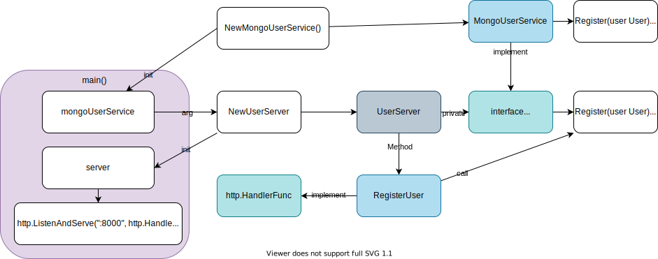

# Questions and answers

## OS Exec

Condition:
- `os/exec.Command()` is called in `GetData()`.
- Want to use test data in tests.
Question: Should I add a "test" flag like `GetData(mode string)`?
Answer: [Dependency Injection](https://quii.gitbook.io/learn-go-with-tests/go-fundamentals/dependency-injection)

1. before

    ```go
	cmd := exec.Command("cat", "msg.xml")

	out, _ := cmd.StdoutPipe()
	var payload Payload
	decoder := xml.NewDecoder(out)
    ```

1. after

    ```go
    func GetData(data io.Reader) string {
        var payload Payload
        xml.NewDecoder(data).Decode(&payload)
        return strings.ToUpper(payload.Message)
    }

    func getXMLFromCommand() io.Reader {
        cmd := exec.Command("cat", "msg.xml")
        out, _ := cmd.StdoutPipe()

        cmd.Start()
        data, _ := ioutil.ReadAll(out)
        cmd.Wait()

        return bytes.NewReader(data)
    }
    ```
1. Now we can test `GetData`.

    ```go
    func TestGetData(t *testing.T) {
        input := strings.NewReader(`
    <payload>
        <message>Cats are the best animal</message>
    </payload>`)

        got := GetData(input)
        want := "CATS ARE THE BEST ANIMAL"

        if got != want {
            t.Errorf("got %q, want %q", got, want)
        }
    }
    ```

## [Error types](https://quii.gitbook.io/learn-go-with-tests/questions-and-answers/error-types)

***Creating your own types for errors can be an elegant way of tidying up your code, making your code easier to use and test.***


Before:

- code
    ```go
    if res.StatusCode != http.StatusOK {
        return "", fmt.Errorf("did not get 200 from %s, got %d", url, res.StatusCode)
    }
    ```
- test
    ```go
	want := fmt.Sprintf("did not get 200 from %s, got %d", svr.URL, http.StatusTeapot)
	got := err.Error()

	if got != want {
		t.Errorf(`got "%v", want "%v"`, got, want)
	}
    ```
- problems
    - same string in prod code and test codes
    - annoying to read and write
    - exact error message is not what we're concerned with

After:
- Use custom Error type

    ```go
    type BadStatusError struct {
        URL    string
        Status int
    }

    func (b BadStatusError) Error() string {
        return fmt.Sprintf("did not get 200 from %s, got %d", b.URL, b.Status)
    }
    ```
- code
    ```go
	if res.StatusCode != http.StatusOK {
		return "", BadStatusError{URL: url, Status: res.StatusCode}
	}
    ```
- test

    ```go
    var got BadStatusError
    isBadStatusError := errors.As(err, &got)
    want := BadStatusError{URL: svr.URL, Status: http.StatusTeapot}

	if !isBadStatusError {
		t.Fatalf("was not a BadStatusError, got %T", err)
	}
    ```
- improvements
    - `DumbGetter` gets simpler
    - Enable more sophisticated error handling with a type assertion
    - Still an `error`. we can treat it in the same way as other errors.

## [Context-aware Reader](https://quii.gitbook.io/learn-go-with-tests/questions-and-answers/context-aware-reader)

What we want to achieve is:

So rather than reading everything, we could:
- Supply a fixed-size byte array that doesnt fit all the contents
- Send a cancel signal
- Try and read again and this should return an error with 0 bytes read

Implementation scenario:

- Creating a context.Context with cancellation so we can cancel after the first read
- For our code to work we'll need to pass ctx to our function
- We then assert that post-cancel nothing was read

```go
type readerCtx struct {
	ctx      context.Context
	delegate io.Reader
}
func (r readerCtx) Read(p []byte) (n int, err error) {
    if err := r.ctx.Err(); err != nil {
		return 0, err
	}
	return r.delegate.Read(p)
}
```

[Delegation pattern](https://en.wikipedia.org/wiki/Delegation_pattern) is an object-oriented design pattern that allows object composition to achieve the same code reuse as inheritance.

## [Revisiting HTTP Handlers](https://quii.gitbook.io/learn-go-with-tests/questions-and-answers/http-handlers-revisited)

How do I test a http handler which has mongodb dependency?

> If your tests are causing you pain, listen to that signal and think about the design of your code.

```go
func Registration(w http.ResponseWriter, r *http.Request) {
...
}
```

1. Write HTTP responses, send headers, status codes, etc.
1. Decode the request's body into a User
1. Connect to a database (and all the details around that)
1. Query the database and applying some business logic depending on the result
1. Generate a password
1. Insert a record

This is too much!

Tips:
- [Separation of Concerns](https://en.wikipedia.org/wiki/Separation_of_concerns)
- [Single Responsibility principle](https://en.wikipedia.org/wiki/Single-responsibility_principle)

Usual HTTP handler:
1. Accept a HTTP request, parse and validate it.
1. Call some ServiceThing to do ImportantBusinessLogic with the data I got from step 1.
1. Send an appropriate HTTP response depending on what ServiceThing returns.

Go's Handler: [http.HandlerFunc](https://golang.org/pkg/net/http/#HandlerFunc)

`type HandlerFunc func(ResponseWriter, *Request)`: *The HandlerFunc type is an adapter to allow the use of ordinary functions as HTTP handlers.*

```go
func Teapot(res http.ResponseWriter, req *http.Request) {
	res.WriteHeader(http.StatusTeapot)
}
```

Separation of concerns:
1. Decode the request's body into a User
1. Call a `UserService.Register(user)`
1. If there's an error act on it, I'll just have a catch-all handler of a `500 internal server error` for now.
1. If there's no error, `201 Created` with the ID as the response body


```go
type UserServer struct {
	service UserService
}

func (u *UserServer) RegisterUser(w http.ResponseWriter, r *http.Request) {
	defer r.Body.Close()

	// request parsing and validation
	var newUser User
	err := json.NewDecoder(r.Body).Decode(&newUser)

	if err != nil {
		http.Error(w, fmt.Sprintf("could not decode user payload: %v", err), http.StatusBadRequest)
		return
	}

	// call a service thing to take care of the hard work
	insertedID, err := u.service.Register(newUser)

	// depending on what we get back, respond accordingly
	if err != nil {
		//todo: handle different kinds of errors differently
		http.Error(w, fmt.Sprintf("problem registering new user: %v", err), http.StatusInternalServerError)
		return
	}

	w.WriteHeader(http.StatusCreated)
	fmt.Fprint(w, insertedID)
}
```

> Our RegisterUser method matches the shape of http.HandlerFunc so we're good to go.



```go
package main

import (
	"encoding/json"
	"fmt"
	"net/http"
)

type User struct {
	Name string
}

type UserService interface {
	Register(user User) (insertedID string, err error)
}

type UserServer struct {
	service UserService
}

func NewUserServer(service UserService) *UserServer {
	return &UserServer{service: service}
}

func (u *UserServer) RegisterUser(w http.ResponseWriter, r *http.Request) {
	defer r.Body.Close()

	// request parsing and validation
	var newUser User
	err := json.NewDecoder(r.Body).Decode(&newUser)

	if err != nil {
		http.Error(w, fmt.Sprintf("could not decode user payload: %v", err), http.StatusBadRequest)
		return
	}

	// call a service thing to take care of the hard work
	insertedID, err := u.service.Register(newUser)

	// depending on what we get back, respond accordingly
	if err != nil {
		//todo: handle different kinds of errors differently
		http.Error(w, fmt.Sprintf("problem registering new user: %v", err), http.StatusInternalServerError)
		return
	}

	w.WriteHeader(http.StatusCreated)
	fmt.Fprint(w, insertedID)
}

type MongoUserService struct {
}

func NewMongoUserService() *MongoUserService {
	//todo: pass in DB URL as argument to this function
	//todo: connect to db, create a connection pool
	return &MongoUserService{}
}

func (m MongoUserService) Register(user User) (insertedID string, err error) {
	// use m.mongoConnection to perform queries
	panic("implement me")
}

func main() {
	mongoService := NewMongoUserService()
	server := NewUserServer(mongoService)
	http.ListenAndServe(":8000", http.HandlerFunc(server.RegisterUser))
}
```

**Go's http handlers are just functions**
