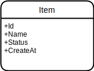
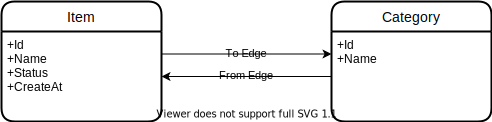

# Simple Example

## Prepare

1. Run postgres
    ```
    docker-compose -f ../docker-compose.yml up -d
    ```
1. Drop and create database `ent_simple_example`
    ```
    docker exec -it postgres psql -U postgres -c '\set AUTOCOMMIT on\n drop database if exists ent_simple_example; create database ent_simple_example'
    ```

## 1. Create Item



1. Create Item
    ```
    go run entgo.io/ent/cmd/ent init Item
    ```

    ```
    tree
    .
    ├── README.md
    └── ent
        ├── generate.go
        └── schema
            └── item.go

    2 directories, 3 files
    ```

1. Define Fields in [ent/schema/item.go](ent/schema/item.go)
    ```go
    // Fields of the Item.
    // id text NOT NULL PRIMARY KEY,
    // name VARCHAR(50) NOT NULL,
    // status SMALLINT NOT NULL,
    // created_at TIMESTAMP NOT NULL
    func (Item) Fields() []ent.Field {
    	return []ent.Field{
    		field.String("id").
    			StructTag(`json:"oid,omitempty"`),
    		field.String("name"),
    		field.Int("status"),
    		field.Time("created_at").
    			Default(time.Now),
    	}
    }
    ```
1. Update [ent/generate.go](ent/generate.go) to use Upsert
    ```go
    //go:generate go run -mod=mod entgo.io/ent/cmd/ent generate --feature sql/upsert ./schema
    ```
1. Generate go.
    ```
    go generate ./ent
    ```
1. Create a script `start/start.go`
    1. Create `main()`
        ```go
        func main() {
            // Init Client
            client, err := ent.Open("postgres", "host=localhost port=5432 user=postgres dbname=ent_simple_example password=postgres sslmode=disable") // hardcoding
            if err != nil {
                log.Fatalf("failed opening connection to postgres: %v", err)
            }
            defer client.Close()

            // Run the auto migration tool.
            if err := client.Schema.Create(context.Background()); err != nil {
                log.Fatalf("failed creating schema resources: %v", err)
            }

            // Create Item
            ctx := context.Background()
            itemId, _ := UpsertItem(ctx, client, "item_id_1", "Item 1")
            fmt.Printf("id: %s\n", itemId)
            itemId2, _ := UpsertItem(ctx, client, "item_id_2", "Item 2")
            fmt.Printf("id: %s\n", itemId2)

            // Get Item
            _, err = QueryItem(ctx, client, "Item 1")
            if err != nil {
                log.Fatal(err)
            }
        }
        ```

    1. Create (Upsert) `Item` (postgres)

        ```go
        func UpsertItem(ctx context.Context, client *ent.Client, itemId, itemName string) (string, error) {
            id, err := client.Debug().Item.
                Create().
                SetID(itemId).
                SetName(itemName).
                SetStatus(1).
                OnConflict(
                    sql.ConflictColumns(item.FieldID),
                ).
                Update(func(u *ent.ItemUpsert) {
                    u.SetName(itemName)
                    u.SetStatus(1)
                }).
                ID(ctx)
            return id, err
        }
        ```

    1. Query `Item` (postgres)

        ```go
        func QueryItem(ctx context.Context, client *ent.Client, name string) (*ent.Item, error) {
            i, err := client.Debug().Item.
                Query().
                Where(item.Name(name)).
                Only(ctx)
            if err != nil {
                return nil, fmt.Errorf("failed querying item: %w", err)
            }
            log.Println("item returned: ", i)
            return i, nil
        }
        ```
1. Run [start/start.go](start/start.go) (rerunnable)
    ```
    go run start/start.go
    ```

    <details>

    ```
    2022/11/11 15:56:09 driver.Query: query=INSERT INTO "items" ("name", "status", "created_at", "id") VALUES ($1, $2, $3, $4) ON CONFLICT ("id") DO UPDATE SET "name" = $5, "status" = $6 RETURNING "id" args=[Item 1 1 2022-11-11 15:56:09.261309 +0900 JST m=+0.098678418 item_id_1 Item 1 1]
    id: item_id_1
    2022/11/11 15:56:09 driver.Query: query=INSERT INTO "items" ("name", "status", "created_at", "id") VALUES ($1, $2, $3, $4) ON CONFLICT ("id") DO UPDATE SET "name" = $5, "status" = $6 RETURNING "id" args=[Item 2 1 2022-11-11 15:56:09.264366 +0900 JST m=+0.101735001 item_id_2 Item 2 1]
    id: item_id_2
    2022/11/11 15:56:09 driver.Query: query=SELECT DISTINCT "items"."id", "items"."name", "items"."status", "items"."created_at" FROM "items" WHERE "items"."name" = $1 LIMIT 2 args=[Item 1]
    2022/11/11 15:56:09 item returned:  Item(id=item_id_1, name=Item 1, status=1, created_at=Fri Nov 11 06:56:09 2022)
    ```

    </details>
1. Check db

    ```
    docker exec -it postgres psql -U postgres -d ent_simple_example -c 'select * from items;'
    ```

    <details>

    ```
        id     |  name  | status |          created_at
    -----------+--------+--------+-------------------------------
     item_id_1 | Item 1 |      1 | 2022-11-11 06:56:09.261309+00
     item_id_2 | Item 2 |      1 | 2022-11-11 06:56:09.264366+00
    (2 rows)
    ```

## 2. Create Edge (`Item` -> `Categories`) [O2M]


1. Create `Category`
    ```
    go run entgo.io/ent/cmd/ent init Category
    ```
1. Create Schema [ent/schema/category.go](ent/schema/category.go)

    ```go
    // Fields of the Category.
    func (Category) Fields() []ent.Field {
        return []ent.Field{
            field.String("id").
                StructTag(`json:"oid,omitempty"`),
            field.String("name"),
        }
    }
    ```
1. Add `categories` Edge to Item schema. [ent/schema/item.go](ent/schema/item.go)

    ```go
    // Edges of the Item.
    func (Item) Edges() []ent.Edge {
        return []ent.Edge{
            edge.To("categories", Category.Type),
        }
    }
    ```
1. Go generate
    ```
    go generate ./ent
    ```
1. Add `UpsertCategory` and `QueryCategory` func to [start/start.go](start/start.go)

    ```go
	// Create Category
	UpsertCategory(ctx, client)

	// Get Category
	_, err = QueryCategory(ctx, client)
	if err != nil {
		log.Fatal(err)
	}
    ```

    ```go
    func UpsertCategory(ctx context.Context, client *ent.Client) (string, error) {
        id, err := client.Debug().Category.
            Create().
            SetID("category_id_1"). // UserIDがUnique指定されている場合
            SetName("Category 1").
            OnConflict(
                sql.ConflictColumns(item.FieldID),
            ).
            Update(func(u *ent.CategoryUpsert) {
                u.SetName("Category 1")
            }).
            ID(ctx)
        return id, err
    }

    func QueryCategory(ctx context.Context, client *ent.Client) (*ent.Category, error) {
        c, err := client.Debug().Category.
            Query().
            Where(category.Name("Category 1")).
            Only(ctx)
        if err != nil {
            return nil, fmt.Errorf("failed querying item: %w", err)
        }
        log.Println("category returned: ", c)
        return c, nil
    }
    ```
1. Run
    ```
    go run start/start.go
    ```

    <details>

    ```
    2022/11/11 16:02:01 driver.Query: query=INSERT INTO "items" ("name", "status", "created_at", "id") VALUES ($1, $2, $3, $4) ON CONFLICT ("id") DO UPDATE SET "name" = $5, "status" = $6 RETURNING "id" args=[Item 1 1 2022-11-11 16:02:01.913175 +0900 JST m=+0.107329959 item_id_1 Item 1 1]
    id: item_id_1
    2022/11/11 16:02:01 driver.Query: query=INSERT INTO "items" ("name", "status", "created_at", "id") VALUES ($1, $2, $3, $4) ON CONFLICT ("id") DO UPDATE SET "name" = $5, "status" = $6 RETURNING "id" args=[Item 2 1 2022-11-11 16:02:01.918769 +0900 JST m=+0.112924459 item_id_2 Item 2 1]
    id: item_id_2
    2022/11/11 16:02:01 driver.Query: query=SELECT DISTINCT "items"."id", "items"."name", "items"."status", "items"."created_at" FROM "items" WHERE "items"."name" = $1 LIMIT 2 args=[Item 1]
    2022/11/11 16:02:01 item returned:  Item(id=item_id_1, name=Item 1, status=1, created_at=Fri Nov 11 06:56:09 2022)
    2022/11/11 16:02:01 driver.Query: query=INSERT INTO "categories" ("name", "id") VALUES ($1, $2) ON CONFLICT ("id") DO UPDATE SET "name" = $3 RETURNING "id" args=[Category 1 category_id_1 Category 1]
    2022/11/11 16:02:01 driver.Query: query=SELECT DISTINCT "categories"."id", "categories"."name" FROM "categories" WHERE "categories"."name" = $1 LIMIT 2 args=[Category 1]
    2022/11/11 16:02:01 category returned:  Category(id=category_id_1, name=Category 1)
    ```

    </details>
1. Check DB
    ```
    docker exec -it postgres psql -U postgres -d ent_simple_example -c 'select * from categories;'
    ```

    ```
          id       |    name    | item_categories
    ---------------+------------+-----------------
     category_id_1 | Category 1 |
    (1 row)
    ```

1. Add `Edge` to the existing `Item`.

    ```go
    category, err := QueryCategory(ctx, client)
    ...
	client.Debug().Item.UpdateOneID("item_id_1").AddCategories(category).Save(ctx)
	client.Debug().Item.UpdateOneID("item_id_2").AddCategories(category).Save(ctx)
    ```

1. Run `start/start.go`

    ```
    go run start/start.go
    ```

    <details>

    ```
    go run start/start.go
    2022/11/11 16:03:04 driver.Query: query=INSERT INTO "items" ("name", "status", "created_at", "id") VALUES ($1, $2, $3, $4) ON CONFLICT ("id") DO UPDATE SET "name" = $5, "status" = $6 RETURNING "id" args=[Item 1 1 2022-11-11 16:03:04.270717 +0900 JST m=+0.082053042 item_id_1 Item 1 1]
    id: item_id_1
    2022/11/11 16:03:04 driver.Query: query=INSERT INTO "items" ("name", "status", "created_at", "id") VALUES ($1, $2, $3, $4) ON CONFLICT ("id") DO UPDATE SET "name" = $5, "status" = $6 RETURNING "id" args=[Item 2 1 2022-11-11 16:03:04.274271 +0900 JST m=+0.085606626 item_id_2 Item 2 1]
    id: item_id_2
    2022/11/11 16:03:04 driver.Query: query=SELECT DISTINCT "items"."id", "items"."name", "items"."status", "items"."created_at" FROM "items" WHERE "items"."name" = $1 LIMIT 2 args=[Item 1]
    2022/11/11 16:03:04 item returned:  Item(id=item_id_1, name=Item 1, status=1, created_at=Fri Nov 11 06:56:09 2022)
    2022/11/11 16:03:04 driver.Query: query=INSERT INTO "categories" ("name", "id") VALUES ($1, $2) ON CONFLICT ("id") DO UPDATE SET "name" = $3 RETURNING "id" args=[Category 1 category_id_1 Category 1]
    2022/11/11 16:03:04 driver.Query: query=SELECT DISTINCT "categories"."id", "categories"."name" FROM "categories" WHERE "categories"."name" = $1 LIMIT 2 args=[Category 1]
    2022/11/11 16:03:04 category returned:  Category(id=category_id_1, name=Category 1)
    2022/11/11 16:03:04 driver.Tx(3ac1eebd-0c60-4874-af91-582d04840f18): started
    2022/11/11 16:03:04 Tx(3ac1eebd-0c60-4874-af91-582d04840f18).Exec: query=UPDATE "categories" SET "item_categories" = $1 WHERE "id" = $2 AND "item_categories" IS NULL args=[item_id_1 category_id_1]
    2022/11/11 16:03:04 Tx(3ac1eebd-0c60-4874-af91-582d04840f18).Query: query=SELECT "id", "name", "status", "created_at" FROM "items" WHERE "id" = $1 args=[item_id_1]
    2022/11/11 16:03:04 Tx(3ac1eebd-0c60-4874-af91-582d04840f18): committed
    2022/11/11 16:03:04 driver.Tx(7fb97727-a8aa-478c-8bfa-c035db3bf058): started
    2022/11/11 16:03:04 Tx(7fb97727-a8aa-478c-8bfa-c035db3bf058).Exec: query=UPDATE "categories" SET "item_categories" = $1 WHERE "id" = $2 AND "item_categories" IS NULL args=[item_id_2 category_id_1]
    2022/11/11 16:03:04 Tx(7fb97727-a8aa-478c-8bfa-c035db3bf058): rollbacked
    ```

    The second update for AddCategories was `rollbacked`.

    </details>

1. Check schema

    ```
    go run -mod=mod entgo.io/ent/cmd/ent describe ./ent/schema
    ```

    <details>

    ```
    Category:
            +-------+--------+--------+----------+----------+---------+---------------+-----------+-----------------------+------------+
            | Field |  Type  | Unique | Optional | Nillable | Default | UpdateDefault | Immutable |       StructTag       | Validators |
            +-------+--------+--------+----------+----------+---------+---------------+-----------+-----------------------+------------+
            | id    | string | false  | false    | false    | false   | false         | false     | json:"oid,omitempty"  |          0 |
            | name  | string | false  | false    | false    | false   | false         | false     | json:"name,omitempty" |          0 |
            +-------+--------+--------+----------+----------+---------+---------------+-----------+-----------------------+------------+

    Item:
            +------------+-----------+--------+----------+----------+---------+---------------+-----------+-----------------------------+------------+
            |   Field    |   Type    | Unique | Optional | Nillable | Default | UpdateDefault | Immutable |          StructTag          | Validators |
            +------------+-----------+--------+----------+----------+---------+---------------+-----------+-----------------------------+------------+
            | id         | string    | false  | false    | false    | false   | false         | false     | json:"oid,omitempty"        |          0 |
            | name       | string    | false  | false    | false    | false   | false         | false     | json:"name,omitempty"       |          0 |
            | status     | int       | false  | false    | false    | false   | false         | false     | json:"status,omitempty"     |          0 |
            | created_at | time.Time | false  | false    | false    | true    | false         | false     | json:"created_at,omitempty" |          0 |
            +------------+-----------+--------+----------+----------+---------+---------------+-----------+-----------------------------+------------+
            +------------+----------+---------+---------+----------+--------+----------+
            |    Edge    |   Type   | Inverse | BackRef | Relation | Unique | Optional |
            +------------+----------+---------+---------+----------+--------+----------+
            | categories | Category | false   |         | O2M      | false  | true     |
            +------------+----------+---------+---------+----------+--------+----------+
    ```
    </details>

1. Check `categories` table. `item_categories` field is added.

    ```sql
    docker exec -it postgres psql -U postgres -d ent_simple_example -c 'select * from categories;'
    ```

    ```
          id       |    name    | item_categories
    ---------------+------------+-----------------
     category_id_1 | Category 1 | item_id_1
    (1 row)
    ```

    ```sql
    docker exec -it postgres psql -U postgres -d ent_simple_example -c '\d categories'
    ```

    <details>

    ```
                          Table "public.categories"
         Column      |       Type        | Collation | Nullable | Default
    -----------------+-------------------+-----------+----------+---------
     id              | character varying |           | not null |
     name            | character varying |           | not null |
     item_categories | character varying |           |          |
    Indexes:
        "categories_pkey" PRIMARY KEY, btree (id)
    Foreign-key constraints:
        "categories_items_categories" FOREIGN KEY (item_categories) REFERENCES items(id) ON DELETE SET NULL
    ```

    </details>

## 3. Add Inverse Edge (`Category` -> `Item`) [M2M]



1. Add `BackRef`

    ```go
    // Edges of the Category.
    func (Category) Edges() []ent.Edge {
        return []ent.Edge{
            // Create an inverse-edge called "items" of type `Items`
            // and reference it to the "categories" edge (in Item schema)
            // explicitly using the `Ref` method.
            edge.From("items", Item.Type).
                Ref("categories"),
            //   Unique(), Not add Unique to make it M2M. Otherwise, O2M
        }
    }
    ```
1. Go generate
    ```
    go generate ./ent
    ```
1. Add `QueryCategoryForItem`

    ```go
    QueryCategoryForItem(ctx, category)
    ```

    ```go
    func QueryCategoryForItem(ctx context.Context, category *ent.Category) error {
        items, err := category.QueryItems().All(ctx)
        if err != nil {
            return fmt.Errorf("failed querying user categories: %w", err)
        }
        // Query the inverse edge.
        for _, i := range items {
            category, err := i.QueryCategories().Only(ctx)
            if err != nil {
                return fmt.Errorf("failed querying item %q category: %w", i.Name, err)
            }
            log.Printf("item %q category: %q\n", i.Name, category.Name)
        }
        return nil
    }
    ```

1. Run
    ```
    go run start/start.go
    ```

    <details>

    ```
    2022/11/11 15:46:43 driver.Query: query=INSERT INTO "items" ("name", "status", "created_at", "id") VALUES ($1, $2, $3, $4) ON CONFLICT ("id") DO UPDATE SET "name" = $5, "status" = $6 RETURNING "id" args=[Item 1 1 2022-11-11 15:46:43.514825 +0900 JST m=+0.081970043 item_id_1 Item 1 1]
    id: item_id_1
    2022/11/11 15:46:43 driver.Query: query=INSERT INTO "items" ("name", "status", "created_at", "id") VALUES ($1, $2, $3, $4) ON CONFLICT ("id") DO UPDATE SET "name" = $5, "status" = $6 RETURNING "id" args=[Item 2 1 2022-11-11 15:46:43.518207 +0900 JST m=+0.085351626 item_id_2 Item 2 1]
    id: item_id_2
    2022/11/11 15:46:43 driver.Query: query=SELECT DISTINCT "items"."id", "items"."name", "items"."status", "items"."created_at" FROM "items" WHERE "items"."name" = $1 LIMIT 2 args=[Item 1]
    2022/11/11 15:46:43 item returned:  Item(id=item_id_1, name=Item 1, status=1, created_at=Fri Nov 11 06:46:43 2022)
    2022/11/11 15:46:43 driver.Query: query=INSERT INTO "categories" ("name", "id") VALUES ($1, $2) ON CONFLICT ("id") DO UPDATE SET "name" = $3 RETURNING "id" args=[Category 1 category_id_1 Category 1]
    id: category_id_1
    2022/11/11 15:46:43 driver.Query: query=SELECT DISTINCT "categories"."id", "categories"."name" FROM "categories" WHERE "categories"."name" = $1 LIMIT 2 args=[Category 1]
    2022/11/11 15:46:43 category returned:  Category(id=category_id_1, name=Category 1)
    2022/11/11 15:46:43 driver.Tx(8e7aed02-ecfb-4cb6-8269-265995e09895): started
    2022/11/11 15:46:43 Tx(8e7aed02-ecfb-4cb6-8269-265995e09895).Exec: query=INSERT INTO "item_categories" ("item_id", "category_id") VALUES ($1, $2) args=[item_id_1 category_id_1]
    2022/11/11 15:46:43 Tx(8e7aed02-ecfb-4cb6-8269-265995e09895).Query: query=SELECT "id", "name", "status", "created_at" FROM "items" WHERE "id" = $1 args=[item_id_1]
    2022/11/11 15:46:43 Tx(8e7aed02-ecfb-4cb6-8269-265995e09895): committed
    2022/11/11 15:46:43 driver.Tx(8b4e10ac-db46-4c57-89e4-f8944586180f): started
    2022/11/11 15:46:43 Tx(8b4e10ac-db46-4c57-89e4-f8944586180f).Exec: query=INSERT INTO "item_categories" ("item_id", "category_id") VALUES ($1, $2) args=[item_id_2 category_id_1]
    2022/11/11 15:46:43 Tx(8b4e10ac-db46-4c57-89e4-f8944586180f).Query: query=SELECT "id", "name", "status", "created_at" FROM "items" WHERE "id" = $1 args=[item_id_2]
    2022/11/11 15:46:43 Tx(8b4e10ac-db46-4c57-89e4-f8944586180f): committed
    2022/11/11 15:46:43 driver.Tx(c4f325ad-1dba-49c2-be9c-edb3a1073f32): started
    2022/11/11 15:46:43 Tx(c4f325ad-1dba-49c2-be9c-edb3a1073f32).Exec: query=INSERT INTO "item_categories" ("item_id", "category_id") VALUES ($1, $2) args=[item_id_1 category_id_1]
    2022/11/11 15:46:43 Tx(c4f325ad-1dba-49c2-be9c-edb3a1073f32): rollbacked
    2022/11/11 15:46:43 driver.Query: query=SELECT DISTINCT "items"."id", "items"."name", "items"."status", "items"."created_at" FROM "items" JOIN (SELECT "item_categories"."item_id" FROM "item_categories" WHERE "item_categories"."category_id" = $1) AS "t1" ON "items"."id" = "t1"."item_id" args=[category_id_1]
    2022/11/11 15:46:43 driver.Query: query=SELECT DISTINCT "categories"."id", "categories"."name" FROM "categories" JOIN (SELECT "item_categories"."category_id" FROM "item_categories" WHERE "item_categories"."item_id" = $1) AS "t1" ON "categories"."id" = "t1"."category_id" LIMIT 2 args=[item_id_1]
    2022/11/11 15:46:43 item "Item 1" category: "Category 1"
    2022/11/11 15:46:43 driver.Query: query=SELECT DISTINCT "categories"."id", "categories"."name" FROM "categories" JOIN (SELECT "item_categories"."category_id" FROM "item_categories" WHERE "item_categories"."item_id" = $1) AS "t1" ON "categories"."id" = "t1"."category_id" LIMIT 2 args=[item_id_2]
    2022/11/11 15:46:43 item "Item 2" category: "Category 1"
    ```

    </details>

1. Check schema (M2M)

    ```
    go run -mod=mod entgo.io/ent/cmd/ent describe ./ent/schema
    ```

    <details>

    ```
    Category:
            +-------+--------+--------+----------+----------+---------+---------------+-----------+-----------------------+------------+
            | Field |  Type  | Unique | Optional | Nillable | Default | UpdateDefault | Immutable |       StructTag       | Validators |
            +-------+--------+--------+----------+----------+---------+---------------+-----------+-----------------------+------------+
            | id    | string | false  | false    | false    | false   | false         | false     | json:"oid,omitempty"  |          0 |
            | name  | string | false  | false    | false    | false   | false         | false     | json:"name,omitempty" |          0 |
            +-------+--------+--------+----------+----------+---------+---------------+-----------+-----------------------+------------+
            +-------+------+---------+------------+----------+--------+----------+
            | Edge  | Type | Inverse |  BackRef   | Relation | Unique | Optional |
            +-------+------+---------+------------+----------+--------+----------+
            | items | Item | true    | categories | M2M      | false  | true     |
            +-------+------+---------+------------+----------+--------+----------+

    Item:
            +------------+-----------+--------+----------+----------+---------+---------------+-----------+-----------------------------+------------+
            |   Field    |   Type    | Unique | Optional | Nillable | Default | UpdateDefault | Immutable |          StructTag          | Validators |
            +------------+-----------+--------+----------+----------+---------+---------------+-----------+-----------------------------+------------+
            | id         | string    | false  | false    | false    | false   | false         | false     | json:"oid,omitempty"        |          0 |
            | name       | string    | false  | false    | false    | false   | false         | false     | json:"name,omitempty"       |          0 |
            | status     | int       | false  | false    | false    | false   | false         | false     | json:"status,omitempty"     |          0 |
            | created_at | time.Time | false  | false    | false    | true    | false         | false     | json:"created_at,omitempty" |          0 |
            +------------+-----------+--------+----------+----------+---------+---------------+-----------+-----------------------------+------------+
            +------------+----------+---------+---------+----------+--------+----------+
            |    Edge    |   Type   | Inverse | BackRef | Relation | Unique | Optional |
            +------------+----------+---------+---------+----------+--------+----------+
            | categories | Category | false   |         | M2M      | false  | true     |
            +------------+----------+---------+---------+----------+--------+----------+
    ```

    </details>

1. Check DB

    ```
    docker exec -it postgres psql -U postgres -d ent_simple_example -c 'select * from categories;'
    docker exec -it postgres psql -U postgres -d ent_simple_example -c 'select * from items;'
    docker exec -it postgres psql -U postgres -d ent_simple_example -c 'select * from item_categories;'
    ```

    <details>

    ```
    ➜  simple-example git:(update-ent) ✗ docker exec -it postgres psql -U postgres -d ent_simple_example -c 'select * from     categories;'
          id       |    name
    ---------------+------------
     category_id_1 | Category 1
    (1 row)

    ➜  simple-example git:(update-ent) ✗ docker exec -it postgres psql -U postgres -d ent_simple_example -c 'select * from     items;'
        id     |  name  | status |          created_at
    -----------+--------+--------+-------------------------------
     item_id_1 | Item 1 |      1 | 2022-11-11 06:46:43.514825+00
     item_id_2 | Item 2 |      1 | 2022-11-11 06:46:43.518207+00
    (2 rows)

    ➜  simple-example git:(update-ent) ✗ docker exec -it postgres psql -U postgres -d ent_simple_example -c 'select * from     item_categories;'
      item_id  |  category_id
    -----------+---------------
     item_id_1 | category_id_1
     item_id_2 | category_id_1
    (2 rows)
    ```

    </details>


## 4. Play with ent syntax

1. Basic (Select + Where)

    ```go
	items, _ := client.Debug().Item.Query().Where(item.Or(
		item.CreatedAt(time.Now()),
		item.And(item.CreatedAtEQ(time.Now()),
			item.IDLT("item_id_1")),
	)).All(ctx)
    ```

1. `predicates`

    ```go
    var predicates []predicate.Item
	predicates = append(predicates,
		func(s *sql.Selector) {
			s.Where(sql.CompositeGT([]string{s.C(item.FieldCreatedAt), s.C(item.FieldID)}, time.Now(), "item_ids"))
		},
	)
    client.Debug().Item.
		Query().
		Where(predicates...).AllX(ctx)
    ```

    1. [sql.Selector](https://github.com/ent/ent/blob/v0.11.4/dialect/sql/builder.go#L2121): Selector is a builder for the `SELECT` statement.
    1. [CompositeGT](https://github.com/ent/ent/blob/c063978d68ca1ca6c6bdd6d1474f267637c67fde/dialect/sql/builder.go#L1793): CompositeGT returns a composite ">" predicate
    1. [Selector.C](https://github.com/ent/ent/blob/v0.11.4/dialect/sql/builder.go#L2472): C returns a formatted string for a selected column from this statement.
1. Check query

    ```go
	t1 := sql.Table("items")
	dialectBuilder := sql.Dialect(dialect.Postgres).
		Select().
		From(t1).
		Where(sql.CompositeGT(t1.Columns(item.FieldCreatedAt, item.FieldID), time.Now(), "item_id_1"))

	query, _ := dialectBuilder.Query()
	fmt.Println(query)
    ```
1. Debug mode

    ```go
    client.Debug()
    ```
    With debug mode, you can check the generated SQL.
