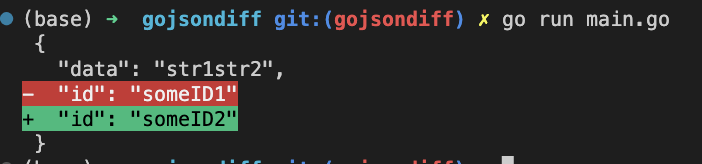

# [gojsondiff](https://github.com/yudai/gojsondiff)

```go
func main() {
	differ := diff.New()
	byt1 := []byte(`{"id":"someID1","data":"str1str2"}`)
	byt2 := []byte(`{"id":"someID2","data":"str1str2"}`)
	d, err := differ.Compare(byt1, byt2)
	if err != nil {
		log.Fatal(err)
	}
	if d.Modified() {
		var aJson map[string]interface{}
		json.Unmarshal(byt1, &aJson)
		config := formatter.AsciiFormatterConfig{
			ShowArrayIndex: true,
			Coloring:       true,
		}
		formatter := formatter.NewAsciiFormatter(aJson, config)
		diffString, err := formatter.Format(d)
		if err != nil {
			log.Fatal(err)
		}
		fmt.Print(diffString)
	}
}
```


```
go run main.go
```




## Ref
- https://github.com/yudai/gojsondiff/blob/master/jd/main.go
