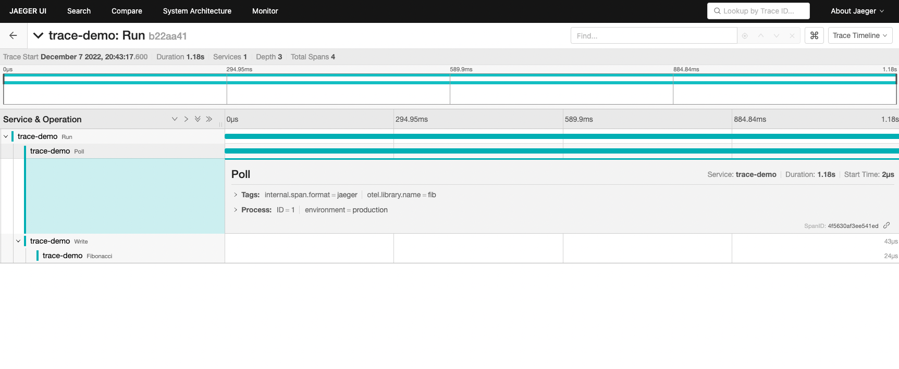

# Open Telemetry

## 1. [Getting Started](https://opentelemetry.io/docs/instrumentation/go/getting-started/)

1. Have your application instrumented to produce telemetry data
1. have an exporter to send that data to the console
1. `TraceProvider` connects them. It is a centralized point where instrumentation will get a Tracer from and funnels the telemetry data from these Tracers to export pipelines.
    `SpanProcessor`: receive and transmit data to exporters

### 1.1. Make Fibonacci app

1. `fib.go`
1. `app.go`
    ```go
    // Run starts polling users for Fibonacci number requests and writes results.
    func (a *App) Run(ctx context.Context) error {
        for {
            n, err := a.Poll(ctx)
            if err != nil {
                return err
            }

            a.Write(ctx, n)
        }
    }
    ```
1. `main.go`

### 1.2. Run the app

```
go run .
```

### 1.3. Trace Instrumentation

1. Add the imports to app.go

    ```go
    import (
        "context"
        "fmt"
        "io"
        "log"
        "strconv"

        "go.opentelemetry.io/otel"
        "go.opentelemetry.io/otel/attribute"
        "go.opentelemetry.io/otel/trace"
    )
    ```
1. Add trace
    > The OpenTelemetry Tracing API provides a Tracer to create traces.

    > A **trace** is a record of the connection(s) between participants processing a transaction.

    `Run`: (in the same way for `Poll` and `Write`)
    ```go
    newCtx, span := otel.Tracer(name).Start(ctx, "Run") // trace for Run

    // a target work
    span.End()
    ```

    For `Fibonacci`:
    ```go
	f, err := func(ctx context.Context) (uint64, error) {
		_, span := otel.Tracer(name).Start(ctx, "Fibonacci")
		defer span.End()
		return Fibonacci(n)
	}(ctx)
    ```

    Trace would be like the following:

    ```
    Run
    ├── Poll
    └── Write
        └── Fibonacci
    ```
### 1.4. Exporter
1. Add Console Exporter to `main.go`

    ```go
    // newExporter returns a console exporter.
    func newExporter(w io.Writer) (trace.SpanExporter, error) {
        return stdouttrace.New(
            stdouttrace.WithWriter(w),
            // Use human-readable output.
            stdouttrace.WithPrettyPrint(),
            // Do not print timestamps for the demo.
            stdouttrace.WithoutTimestamps(),
        )
    }
    ```

### 1.5. Resource
1. Add a Resource to `main.go`

    ```go
    // newResource returns a resource describing this application.
    func newResource() *resource.Resource {
        r, _ := resource.Merge(
            resource.Default(),
            resource.NewWithAttributes(
                semconv.SchemaURL,
                semconv.ServiceNameKey.String("fib"),
                semconv.ServiceVersionKey.String("v0.1.0"),
                attribute.String("environment", "demo"),
            ),
        )
        return r
    }
    ```
### 1.6. TracerProvider
1. Add TracerProvider to main.

    ```go
	// Write telemetry data to a file.
	f, err := os.Create("traces.txt")
	if err != nil {
		l.Fatal(err)
	}
	defer f.Close()

	exp, err := newExporter(f)
	if err != nil {
		l.Fatal(err)
	}

	tp := trace.NewTracerProvider(
		trace.WithBatcher(exp),
		trace.WithResource(newResource()),
	)
	defer func() {
		if err := tp.Shutdown(context.Background()); err != nil {
			l.Fatal(err)
		}
	}()
	otel.SetTracerProvider(tp)
    ```

    Here regisitering the TracerProvider globally in instrumentation means that the connect the instrumentation's Tracer to this TracerProvider. This global TracerProvider is not always the best option though.
1. Run

    ```
    go run .
    ```

    There's `traces.txt`

    ```json
    {
        "Name": "Run",
        "SpanContext": {
                "TraceID": "b8c0291b6e5c0de0822cd8a4e98eca18",
                "SpanID": "cae41bc2b5d984a8",
                "TraceFlags": "01",
                "TraceState": "",
                "Remote": false
        },
        "Parent": {
                "TraceID": "00000000000000000000000000000000",
                "SpanID": "0000000000000000",
                "TraceFlags": "00",
                "TraceState": "",
                "Remote": false
        },
        ...
    ```

## 2. Jaegar Exporter

https://github.com/open-telemetry/opentelemetry-go/tree/main/exporters/jaeger

1. Run Jaegar

    ```
    docker run -d --name jaeger \
      -e COLLECTOR_ZIPKIN_HOST_PORT=:9411 \
      -e COLLECTOR_OTLP_ENABLED=true \
      -p 6831:6831/udp \
      -p 6832:6832/udp \
      -p 5778:5778 \
      -p 16686:16686 \
      -p 4317:4317 \
      -p 4318:4318 \
      -p 14250:14250 \
      -p 14268:14268 \
      -p 14269:14269 \
      -p 9411:9411 \
      jaegertracing/all-in-one:latest
    ```

    Check:

    1. server

    ```
    curl http://localhost:14269/
    {"status":"Server available","upSince":"2022-12-07T11:31:52.359472384Z","uptime":"36.4175651s"}%
    ```

    1. Jaegar UI: http://localhost:16686/search


1. Create `TracerProvider` with Jaegar exporter

    ```go
    // tracerProvider returns an OpenTelemetry TracerProvider configured to use
    // the Jaeger exporter that will send spans to the provided url. The returned
    // TracerProvider will also use a Resource configured with all the information
    // about the application.
    func tracerProvider(url string) (*tracesdk.TracerProvider, error) {
    	// Create the Jaeger exporter
    	exp, err := jaeger.New(jaeger.WithCollectorEndpoint(jaeger.WithEndpoint(url)))
    	if err != nil {
    		return nil, err
    	}
    	tp := tracesdk.NewTracerProvider(
    		// Always be sure to batch in production.
    		tracesdk.WithBatcher(exp),
    		// Record information about this application in a Resource.
    		tracesdk.WithResource(resource.NewWithAttributes(
    			semconv.SchemaURL,
    			semconv.ServiceNameKey.String(service),
    			attribute.String("environment", environment),
    			attribute.Int64("ID", id),
    		)),
    	)
    	return tp, nil
    }
    ```
1. Update `main()`

    ```go
    func main() {
    	l := log.New(os.Stdout, "", 0)

    	tp, err := tracerProvider("http://localhost:14269/api/traces")
    	if err != nil {
    		log.Fatal(err)
    	}
    	defer func() {
    		if err := tp.Shutdown(context.Background()); err != nil {
    			l.Fatal(err)
    		}
    	}()
    	otel.SetTracerProvider(tp)

    	sigCh := make(chan os.Signal, 1)
    	signal.Notify(sigCh, os.Interrupt)

    	errCh := make(chan error)
    	app := NewApp(os.Stdin, l)
    	go func() {
    		errCh <- app.Run(context.Background())
    	}()

    	select {
    	case <-sigCh:
    		l.Println("\ngoodbye")
    		return
    	case err := <-errCh:
    		if err != nil {
    			l.Fatal(err)
    		}
    	}
    }
    ```

1. Run

    ```
    go run .
    What Fibonacci number would you like to know:
    10
    Fibonacci(10) = 55
    What Fibonacci number would you like to know:
    20
    Fibonacci(20) = 6765
    What Fibonacci number would you like to know:
    10
    Fibonacci(10) = 55
    What Fibonacci number would you like to know:
    ```

1. Check Jaegar UI on http://localhost:16686/search

    

## 3. [Zipkin](https://github.com/openzipkin/zipkin)

1. Run [zipkin](https://zipkin.io/)
    ```
    docker run -d -p 9411:9411 openzipkin/zipkin
    ```
