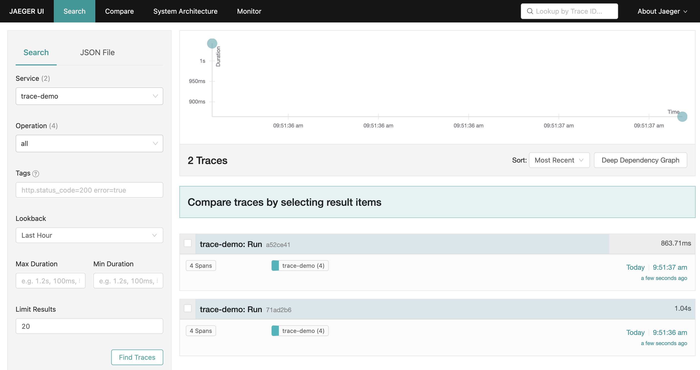
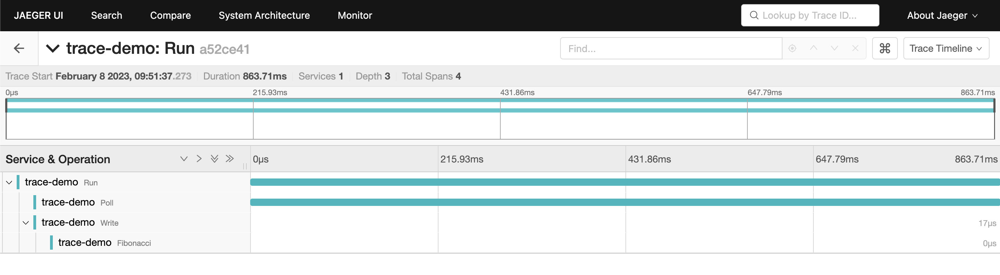
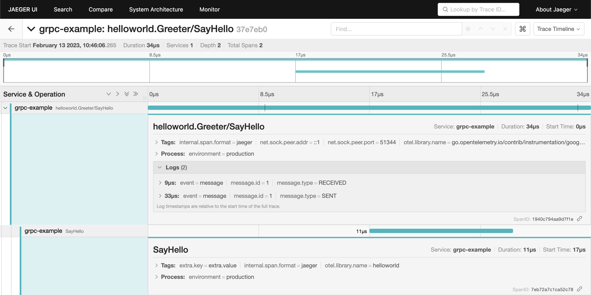
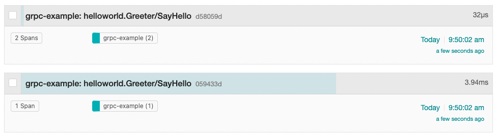
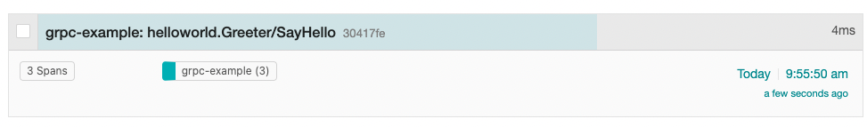
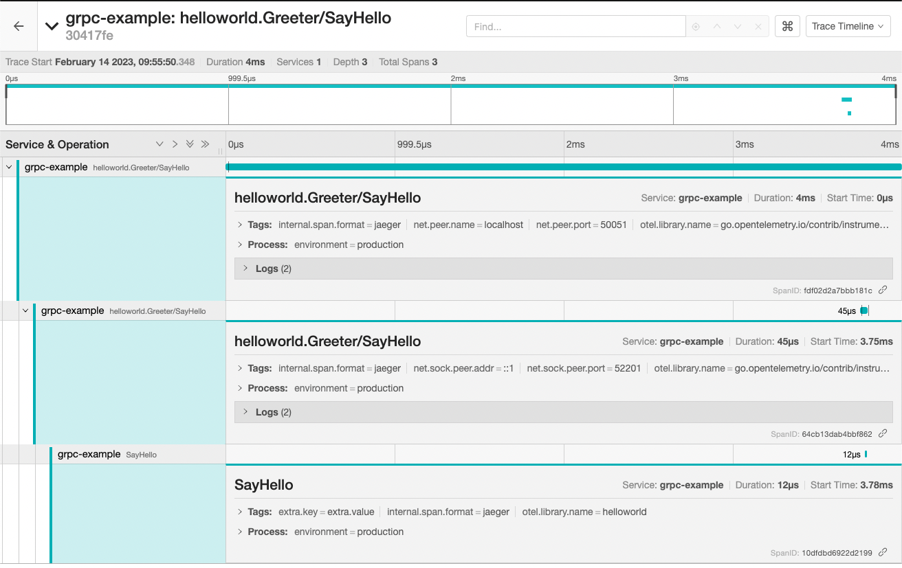
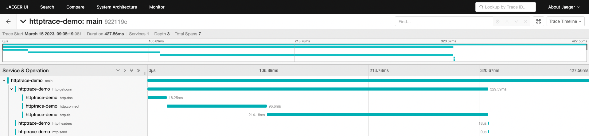
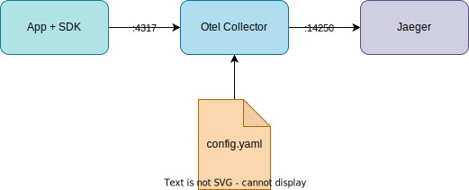

# Open Telemetry

OTel’s goal is to provide a set of **standardized vendor-agnostic SDKs, APIs, and tools for ingesting, transforming, and sending data to an Observability back-end**

## Overview (WIP)



## Tracing Model




## 1. [Getting Started](https://opentelemetry.io/docs/instrumentation/go/getting-started/)

1. Instrument your application to produce telemetry data with `Tracer`.
1. Create an **exporter** to send that data to the console.
1. `TraceProvider` connects them. It is a centralized point where instrumentation will get a Tracer from and funnels the telemetry data from these Tracers to export pipelines. (config: SpanProcessors, IdGenerator, SpanLimits and Sampler)
    1. `SpanProcessor`: receive and transmit data to exporters

### 1.1. Make Fibonacci app

Fibonacci app: return the Fibonacci number for the number provided by the input.

1. [fib/fib.go](fib/fib.go)

1. [fib/app.go](fib/app.go)
    ```go
    // Run starts polling users for Fibonacci number requests and writes results.
    func (a *App) Run(ctx context.Context) error {
        for {
            n, err := a.Poll(ctx)
            if err != nil {
                return err
            }

            a.Write(ctx, n)
        }
    }
    ```
1. [base/main.go](base/main.go)
1. Run

    ```
    go run base/main.go
    What Fibonacci number would you like to know:
    10
    Fibonacci(10) = 55
    What Fibonacci number would you like to know:
    20
    Fibonacci(20) = 6765
    What Fibonacci number would you like to know:
    ^C
    goodbye
    ```

### 1.2. Trace Instrumentation

#### 1.2.1. Trace Instrumentation - Basic

Instrumentation: Generate trace in the target app with `Tracer`.

1. Add the imports to [fib/app.go](fib/app.go)

    ```go
    import (
        "context"
        "fmt"
        "io"
        "log"
        "strconv"

        "go.opentelemetry.io/otel"
        "go.opentelemetry.io/otel/attribute"
        "go.opentelemetry.io/otel/trace"
    )
    ```

1. Add trace in [fib/app.go](fib/app.go)
    > The OpenTelemetry Tracing API provides a Tracer to create traces.

    > A **trace** is a record of the connection(s) between participants processing a transaction.

    `Run`: (in the same way for `Poll` and `Write`)
    ```go
    newCtx, span := otel.Tracer(name).Start(ctx, "Run") // trace for Run

    // a target work

    span.End()
    ```

    For `Fibonacci`:
    ```go
	f, err := func(ctx context.Context) (uint64, error) {
		_, span := otel.Tracer(name).Start(ctx, "Fibonacci")
		defer span.End()
		return Fibonacci(n)
	}(ctx)
    ```

    Trace would be like the following:

    ```
    Run
    ├── Poll
    └── Write
        └── Fibonacci
    ```

At this point, you can't see the generated traces.

### 1.2.2. Trace Instrumentation - Error

1. You can also record errors by updating `Write` function:

    ```go
    f, err := Fibonacci(n)
    if err != nil {
        span.RecordError(err)
        span.SetStatus(codes.Error, err.Error())
    }
    return f, err
    ```

### 1.3. Exporter

Send the telemetry data (traces) to stdout (console exporter) to make the traces visible.

1. Add Console Exporter to `main.go`

    ```go
    // newExporter returns a console exporter.
    func newExporter(w io.Writer) (trace.SpanExporter, error) {
        return stdouttrace.New(
            stdouttrace.WithWriter(w),
            // Use human-readable output.
            stdouttrace.WithPrettyPrint(),
            // Do not print timestamps for the demo.
            stdouttrace.WithoutTimestamps(),
        )
    }
    ```

### 1.4. Resource

`Resource`: represent the entity producing telemetry.

1. Add a Resource to `main.go`

    ```go
    // newResource returns a resource describing this application.
    func newResource() *resource.Resource {
        r, _ := resource.Merge(
            resource.Default(),
            resource.NewWithAttributes(
                semconv.SchemaURL,
                semconv.ServiceNameKey.String("fib"),
                semconv.ServiceVersionKey.String("v0.1.0"),
                attribute.String("environment", "demo"),
            ),
        )
        return r
    }
    ```
### 1.5. TracerProvider

`TracerProvider` connects instrumentation and exporter by creating and registering Tracer with the exporter.

1. Add `TracerProvider` to main ([console-exporter/main.go](console-exporter/main.go)).

    ```go
	// Write telemetry data to a file.
	f, err := os.Create("traces.txt")
	if err != nil {
		l.Fatal(err)
	}
	defer f.Close()

	exp, err := newExporter(f)
	if err != nil {
		l.Fatal(err)
	}

	tp := trace.NewTracerProvider(
		trace.WithBatcher(exp),
		trace.WithResource(newResource()),
	)
	defer func() {
		if err := tp.Shutdown(context.Background()); err != nil {
			l.Fatal(err)
		}
	}()
	otel.SetTracerProvider(tp)
    ```

    Here regisitering the TracerProvider globally in instrumentation means that the connect the instrumentation's Tracer to this TracerProvider. This global TracerProvider is not always the best option though.
1. Run

    ```
    go run console-exporter/main.go
    What Fibonacci number would you like to know:
    10
    Fibonacci(10) = 55
    What Fibonacci number would you like to know:
    20
    Fibonacci(20) = 6765
    What Fibonacci number would you like to know:
    ^C
    goodbye
    ```

    There's `traces.txt`

    ```json
    {
        "Name": "Poll",
        "SpanContext": {
                "TraceID": "3794e28f6e88a5736da81c5a2dda262a",
                "SpanID": "d3704194fdaa8354",
                "TraceFlags": "01",
                "TraceState": "",
                "Remote": false
        },
        "Parent": {
                "TraceID": "3794e28f6e88a5736da81c5a2dda262a",
                "SpanID": "4c3c9a26044348f1",
                "TraceFlags": "01",
                "TraceState": "",
                "Remote": false
        },
        "SpanKind": 1,
        "StartTime": "0001-01-01T00:00:00Z",
        "EndTime": "0001-01-01T00:00:00Z",
        "Attributes": null,
    ```

## 2. [Jaeger Exporter](https://github.com/open-telemetry/opentelemetry-go/tree/main/exporters/jaeger)

1. Run Jaeger

    ```
    docker run -d --name jaeger \
      -e COLLECTOR_ZIPKIN_HOST_PORT=:9411 \
      -e COLLECTOR_OTLP_ENABLED=true \
      -p 6831:6831/udp \
      -p 6832:6832/udp \
      -p 5778:5778 \
      -p 16686:16686 \
      -p 4317:4317 \
      -p 4318:4318 \
      -p 14250:14250 \
      -p 14268:14268 \
      -p 14269:14269 \
      -p 9411:9411 \
      jaegertracing/all-in-one:latest
    ```

    Check:

    1. server

    ```
    curl http://localhost:14269/
    {"status":"Server available","upSince":"2022-12-07T11:31:52.359472384Z","uptime":"36.4175651s"}%
    ```

    1. Jaeger UI: http://localhost:16686/search


1. Create `TracerProvider` with `Jaeger` exporter in [jaeger-exporter/main.go](jaeger-exporter/main.go)

    ```go
    // tracerProvider returns an OpenTelemetry TracerProvider configured to use
    // the Jaeger exporter that will send spans to the provided url. The returned
    // TracerProvider will also use a Resource configured with all the information
    // about the application.
    func tracerProvider(url string) (*tracesdk.TracerProvider, error) {
    	// Create the Jaeger exporter
    	exp, err := jaeger.New(jaeger.WithCollectorEndpoint(jaeger.WithEndpoint(url)))
    	if err != nil {
    		return nil, err
    	}
    	tp := tracesdk.NewTracerProvider(
    		// Always be sure to batch in production.
    		tracesdk.WithBatcher(exp),
    		// Record information about this application in a Resource.
    		tracesdk.WithResource(resource.NewWithAttributes(
    			semconv.SchemaURL,
    			semconv.ServiceNameKey.String(service),
    			attribute.String("environment", environment),
    			attribute.Int64("ID", id),
    		)),
    	)
    	return tp, nil
    }
    ```
1. Update `main()` in [jaeger-exporter/main.go](jaeger-exporter/main.go)

    ```go
    func main() {
    	l := log.New(os.Stdout, "", 0)

    	tp, err := tracerProvider("http://localhost:14268/api/traces")
    	if err != nil {
    		log.Fatal(err)
    	}
    	defer func() {
    		if err := tp.Shutdown(context.Background()); err != nil {
    			l.Fatal(err)
    		}
    	}()
    	otel.SetTracerProvider(tp)

    	sigCh := make(chan os.Signal, 1)
    	signal.Notify(sigCh, os.Interrupt)

    	errCh := make(chan error)
    	app := NewApp(os.Stdin, l)
    	go func() {
    		errCh <- app.Run(context.Background())
    	}()

    	select {
    	case <-sigCh:
    		l.Println("\ngoodbye")
    		return
    	case err := <-errCh:
    		if err != nil {
    			l.Fatal(err)
    		}
    	}
    }
    ```

1. Run

    ```
    go run jaeger-exporter/main.go
    What Fibonacci number would you like to know:
    10
    Fibonacci(10) = 55
    What Fibonacci number would you like to know:
    20
    Fibonacci(20) = 6765
    What Fibonacci number would you like to know:
    ^C
    goodbye
    ```

1. Check Jaeger UI on http://localhost:16686/search

    1. There are two traces (as we executed Run twice):
        
    1. Click on the first trace and you'll see 4 spans in it:
        
    1. You can also check flamegraph:
        
1. Run and send a request that would cause an error.
    ```
    go run jaeger-exporter/main.go
    What Fibonacci number would you like to know:
    100
    Fibonacci(100): unsupported fibonacci number 100: too large
    What Fibonacci number would you like to know:
    ^C
    goodbye
    ```

## 3. [gRPC Tracing Example](https://github.com/open-telemetry/opentelemetry-go-contrib/tree/instrumentation/google.golang.org/grpc/otelgrpc/example/v0.39.0/instrumentation/google.golang.org/grpc/otelgrpc/example)

- [gRPC Quick start](https://grpc.io/docs/languages/go/quickstart/)
- [gRPC Tracing Example](https://github.com/open-telemetry/opentelemetry-go-contrib/tree/instrumentation/google.golang.org/grpc/otelgrpc/example/v0.39.0/instrumentation/google.golang.org/grpc/otelgrpc/example)

### 3.1. Create proto file

[helloworld.proto](https://github.com/grpc/grpc-go/blob/master/examples/helloworld/helloworld/helloworld.proto)

```
protoc --go_out=. --go_opt=paths=source_relative \--go-grpc_out=. --go-grpc_opt=paths=source_relative \grpc/helloworld/helloworld.proto
```


```protobuf
syntax = "proto3";

option go_package = "google.golang.org/grpc/examples/helloworld/helloworld";
option java_multiple_files = true;
option java_package = "io.grpc.examples.helloworld";
option java_outer_classname = "HelloWorldProto";

package helloworld;

// The greeting service definition.
service Greeter {
  // Sends a greeting
  rpc SayHello (HelloRequest) returns (HelloReply) {}
}

// The request message containing the user's name.
message HelloRequest {
  string name = 1;
}

// The response message containing the greetings
message HelloReply {
  string message = 1;
}

```


### 3.2. Generate gRPC code (no need)

Install Go protocol buffers plugin (if you don't have)

```
go install google.golang.org/protobuf/cmd/protoc-gen-go@latest
```

Generate code

```
protoc --go_out=. --go_opt=paths=source_relative \
--go-grpc_out=. --go-grpc_opt=paths=source_relative \
grpc/helloworld/helloworld.proto
```

This will generate `hello-service_grpc.pb.go` and `hello-service.pb.go` under `grpc/helloworld`

```
tree grpc/helloworld
grpc/helloworld
├── helloworld.pb.go
├── helloworld.proto
└── helloworld_grpc.pb.go

0 directories, 3 files
```

### 3.3. Prepare server and client code

Download from https://github.com/grpc/grpc-go/tree/master/examples/helloworld

server:

```
curl -o grpc/server/main.go  https://raw.githubusercontent.com/grpc/grpc-go/master/examples/helloworld/greeter_server/main.go
```

<details>

If you want to use the generated code:

```
gsed -i 's#google.golang.org/grpc/examples/helloworld/helloworld#tmp/pragmatic-cases/opentelemetry/grpc/helloworld#g' grpc/server/main.go
```

</details>

client:

```
curl -o grpc/client/main.go  https://raw.githubusercontent.com/grpc/grpc-go/master/examples/helloworld/greeter_client/main.g
```

<details>

If you want to use the generated code:

```
gsed -i 's#google.golang.org/grpc/examples/helloworld/helloworld#tmp/pragmatic-cases/opentelemetry/grpc/helloworld#g' grpc/client/main.go
```

</details>

### 3.4. Run (no trace)

1. Run gRPC server.

    ```
    go run grpc/server/main.go
    ```
1. Execute client code. (from another terminal)
    ```
    go run grpc/client/main.go
    2023/02/13 10:01:11 Greeting: Hello world
    ```

### 3.5. Trace Instrumentation
1. Set const.
    ```go
    const (
        service     = "grpc-example"
        environment = "production"
        tracerName  = "helloworld"
    )
    ```
1. Add interceptor to server/main.go

    ```go
	s := grpc.NewServer(
		grpc.UnaryInterceptor(otelgrpc.UnaryServerInterceptor()),
		grpc.StreamInterceptor(otelgrpc.StreamServerInterceptor()),
	)
    ```
1. Add span in `SayHello`
    ```go
    func (s *server) SayHello(ctx context.Context, in *pb.HelloRequest) (*pb.HelloReply, error) {
        _, span := otel.Tracer(tracerName).Start(ctx, "SayHello",
            trace.WithAttributes(attribute.String("extra.key", "extra.value")))
        log.Printf("Received: %v", in.GetName())
        defer span.End()
        return &pb.HelloReply{Message: "Hello " + in.GetName()}, nil
    }
    ```

### 3.6. Set up TraceProvider (with Jaeger)

```go
package main

import (
	"go.opentelemetry.io/otel/attribute"
	"go.opentelemetry.io/otel/exporters/jaeger"
	"go.opentelemetry.io/otel/sdk/resource"
	tracesdk "go.opentelemetry.io/otel/sdk/trace"
	semconv "go.opentelemetry.io/otel/semconv/v1.17.0"
)

func NewJaegerTracerProvider(service, environment, url string) (*tracesdk.TracerProvider, error) {
	// Create the Jaeger exporter
	exp, err := jaeger.New(jaeger.WithCollectorEndpoint(jaeger.WithEndpoint(url)))
	if err != nil {
		return nil, err
	}
	tp := tracesdk.NewTracerProvider(
		// Always be sure to batch in production.
		tracesdk.WithBatcher(exp),
		// Record information about this application in a Resource.
		tracesdk.WithResource(resource.NewWithAttributes(
			semconv.SchemaURL,
			semconv.ServiceName(service),
			attribute.String("environment", environment),
		)),
	)
	return tp, nil
}
```
main:
```go
	tp, err := NewJaegerTracerProvider(service, environment, "http://localhost:14268/api/traces")
	if err != nil {
		log.Fatal(err)
	}
	defer func() {
		if err := tp.Shutdown(context.Background()); err != nil {
			log.Fatal(err)
		}
	}()
	otel.SetTracerProvider(tp) // register tp as the global trace provider
```

### 3.7. Run

1. Run gaeger

    ```
    docker run -d --name jaeger \
      -e COLLECTOR_ZIPKIN_HOST_PORT=:9411 \
      -e COLLECTOR_OTLP_ENABLED=true \
      -p 6831:6831/udp \
      -p 6832:6832/udp \
      -p 5778:5778 \
      -p 16686:16686 \
      -p 4317:4317 \
      -p 4318:4318 \
      -p 14250:14250 \
      -p 14268:14268 \
      -p 14269:14269 \
      -p 9411:9411 \
      jaegertracing/all-in-one:latest
    ```
1. Run server & cient

1. Check

    

### 3.8. Add client side trace

1. Add Jaeger Tracer Provider (same as server)

    ```go
    func NewJaegerTracerProvider(service, environment, url string) (*tracesdk.TracerProvider, error) {
        // Create the Jaeger exporter
        exp, err := jaeger.New(jaeger.WithCollectorEndpoint(jaeger.WithEndpoint(url)))
        if err != nil {
            return nil, err
        }
        tp := tracesdk.NewTracerProvider(
            // Always be sure to batch in production.
            tracesdk.WithBatcher(exp),
            // Record information about this application in a Resource.
            tracesdk.WithResource(resource.NewWithAttributes(
                semconv.SchemaURL,
                semconv.ServiceName(service),
                attribute.String("environment", environment),
            )),
        )
        return tp, nil
    }
    ```


1. Add the following interceptors

    ```go
        conn, err := grpc.Dial(*addr, grpc.WithTransportCredentials(insecure.NewCredentials()),
            grpc.WithUnaryInterceptor(otelgrpc.UnaryClientInterceptor()),
            grpc.WithStreamInterceptor(otelgrpc.StreamClientInterceptor()),
        )
    ```

1. Run server & client
    ```
    go run grpc/server/main.go
    ```

    ```
    go run grpc/client/main.go
    ```

1. Check (Two separate traces)

    

### 3.9. Connect separate traces (server & client)

1. Set propagator in both server and client main.

    ```go
	otel.SetTextMapPropagator(
		propagation.NewCompositeTextMapPropagator(
			propagation.TraceContext{},
			propagation.Baggage{},
		),
	)
    ```
1. Run server & client
    ```
    go run grpc/server/main.go
    ```

    ```
    go run grpc/client/main.go
    ```

1. Check (all three spans are connected)

    
    


## 4. [otelhttptrace](https://pkg.go.dev/go.opentelemetry.io/contrib/instrumentation/net/http/httptrace/otelhttptrace)

1. Run jaeger

    ```
    docker run -d --name jaeger \
      -e COLLECTOR_ZIPKIN_HOST_PORT=:9411 \
      -e COLLECTOR_OTLP_ENABLED=true \
      -p 6831:6831/udp \
      -p 6832:6832/udp \
      -p 5778:5778 \
      -p 16686:16686 \
      -p 4317:4317 \
      -p 4318:4318 \
      -p 14250:14250 \
      -p 14268:14268 \
      -p 14269:14269 \
      -p 9411:9411 \
      jaegertracing/all-in-one:latest
    ```
1. Prepare `main.go`

    1. Use the same `NewJaegerTracerProvider` as above.
    1. In `httpRequest` func, Create clientTrace with `otelhttptrace`, update context and create a request with the context.

        ```go
        // httptrace settings
        clientTrace := otelhttptrace.NewClientTrace(ctx)
        ctx = httptrace.WithClientTrace(ctx, clientTrace)
        req, _ := http.NewRequestWithContext(ctx, "GET", url, nil)
        ```
    1. In `main`, create a Trace and pass the context to `httpRequest` func
        ```go
        ctx, span := tp.Tracer("main").Start(ctx, "main")
        defer span.End()
        ```

    <details><summary>full code</summary>

    ```go
    package main

    import (
        "context"
        "fmt"
        "log"
        "net/http"
        "net/http/httptrace"

        "go.opentelemetry.io/contrib/instrumentation/net/http/httptrace/otelhttptrace"
        "go.opentelemetry.io/otel"
        "go.opentelemetry.io/otel/attribute"
        "go.opentelemetry.io/otel/exporters/jaeger"
        "go.opentelemetry.io/otel/sdk/resource"
        tracesdk "go.opentelemetry.io/otel/sdk/trace"
        semconv "go.opentelemetry.io/otel/semconv/v1.17.0"
    )

    const (
        service     = "httptrace-demo"
        environment = "development"
    )

    func NewJaegerTracerProvider(service, environment, url string) (*tracesdk.TracerProvider, error) {
        // Create the Jaeger exporter
        exp, err := jaeger.New(jaeger.WithCollectorEndpoint(jaeger.WithEndpoint(url)))
        if err != nil {
            return nil, err
        }
        tp := tracesdk.NewTracerProvider(
            // Always be sure to batch in production.
            tracesdk.WithBatcher(exp),
            // Record information about this application in a Resource.
            tracesdk.WithResource(resource.NewWithAttributes(
                semconv.SchemaURL,
                semconv.ServiceName(service),
                attribute.String("environment", environment),
            )),
        )
        return tp, nil
    }

    func httpRequest(ctx context.Context, url string) error {
        // httptrace settings
        clientTrace := otelhttptrace.NewClientTrace(ctx)
        ctx = httptrace.WithClientTrace(ctx, clientTrace)
        req, _ := http.NewRequestWithContext(ctx, "GET", url, nil)

        // send http request
        resp, err := http.DefaultClient.Do(req)
        fmt.Println(resp.StatusCode)
        return err
    }

    func main() {
        ctx := context.Background()
        tp, err := NewJaegerTracerProvider(service, environment, "http://localhost:14268/api/traces")
        if err != nil {
            log.Fatal(err)
        }
        defer func() {
            if err := tp.Shutdown(context.Background()); err != nil {
                log.Fatal(err)
            }
        }()
        otel.SetTracerProvider(tp) // register tp as the global trace provider
        ctx, span := tp.Tracer("main").Start(ctx, "main")
        defer span.End()

        if err := httpRequest(ctx, "https://example.com/"); err != nil {
            log.Fatal(err)
        }
    }
    ```

    </details>

1. Run

    ```
    go run main.go
    ```

    

Ref:
- https://journal.lampetty.net/entry/opentelemetry-httptrace
- https://pkg.go.dev/net/http/httptrace
- https://pkg.go.dev/go.opentelemetry.io/contrib/instrumentation/net/http/httptrace/otelhttptrace

## [5. otel collector + jaeger](otel-collector)



## FAQ

1. What's **Resource**?: The entity that the traces are generated from. (Service, service instance, etc.)
1. [API](https://opentelemetry.io/docs/reference/specification/overview/#api) vs. [SDK](https://opentelemetry.io/docs/reference/specification/overview/#sdk):
1. What's **TraceProvider**?: TracerProvider constructs Tracer with specified configuration and register it to use in the target app.
1. Trace vs. Span: a **Trace** can be thought of as a directed acyclic graph (DAG) of Spans, where the edges between Spans are defined as parent/child relationship. A **Span** is a single operation within a Trace
1. OtelCollector Gateway？:

## Links

1. https://grafana.com/blog/2021/09/23/intro-to-distributed-tracing-with-tempo-opentelemetry-and-grafana-cloud/
1. https://opentelemetry.io/docs/demo/architecture/ <- Really great demo
1. [Tail Sampling Processor](https://github.com/open-telemetry/opentelemetry-collector-contrib/blob/main/processor/tailsamplingprocessor/README.md#probabilistic-sampling-processor-compared-to-the-tail-sampling-processor-with-the-probabilistic-policy)
1. [Probabilistic Sampling Processor](https://github.com/open-telemetry/opentelemetry-collector-contrib/tree/main/processor/probabilisticsamplerprocessor)


