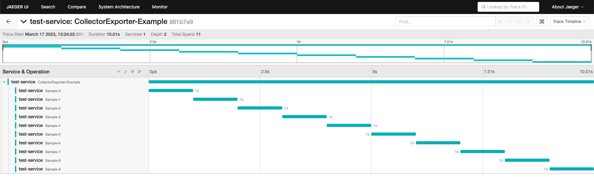

# Otel Collector + Jaeger


## Steps

1. Create Docker network
    ```
    docker network create otlp
    ```
1. Start jaeger

    ```
    docker run -d --name jaeger \
      --network=otlp \
      -e COLLECTOR_ZIPKIN_HOST_PORT=:9411 \
      -e COLLECTOR_OTLP_ENABLED=true \
      -p 16686:16686 \
      -p 14250:14250 \
      jaegertracing/all-in-one:latest
    ```
1. prepare otel collector `config.docker.yaml`

    ```yaml
    receivers:
      otlp:
        protocols:
          grpc:
            endpoint: "0.0.0.0:4317"

    processors:

    exporters:
      jaeger:
        endpoint: jaeger:14250
        tls:
          insecure: true

    service:
      pipelines:
        traces:
          receivers: [otlp]
          processors: []
          exporters: [jaeger]
      telemetry:
        logs:
          level: debug
    ```
1. start otel-collector

    ```
    docker run -d --name otel-collector \
      --network=otlp \
      -p 4317:4317 \
      -v $(pwd)/config.docker.yaml:/config.yaml:z \
      otel/opentelemetry-collector-contrib:0.59.0 \
      --config=/config.yaml
    ```
1. Run application
    ```
    go run main.go
    ```

1. Check trace on http://localhost:16686
    

1. clean up

    ```
    docker rm -f jaeger
    docker rm -f otel-collector
    docker network rm otlp
    ```

## Tips

If you can't see traces, you can debug with `otelcol` cli:

1. Run jaeger with the same command as above.
1. Install `otelcol`
    ```
    curl -O -L https://github.com/open-telemetry/opentelemetry-collector-releases/releases/download/v0.73.0/otelcol_0.73.0_darwin_arm64.tar.gz
    tar -xvf otelcol_0.73.0_darwin_arm64.tar.gz
    ./otelcol -h
    ```
1. prepare otel collector config

    ```yaml
    receivers:
      otlp:
        protocols:
          grpc:
            endpoint: "0.0.0.0:4317"

    processors:

    exporters:
      jaeger:
        endpoint: localhost:14250 # this is localhost
        tls:
          insecure: true

    service:
      pipelines:
        traces:
          receivers: [otlp]
          processors: []
          exporters: [jaeger]
      telemetry:
        logs:
          level: debug
    ```
1. start otel-collector
    ```
    ./otelcol --config config.yaml
    ```

## Ref
1. https://github.com/open-telemetry/opentelemetry-go/tree/main/example/otel-collector
1. https://github.com/open-telemetry/opentelemetry-go/tree/main/exporters/otlp/otlptrace
